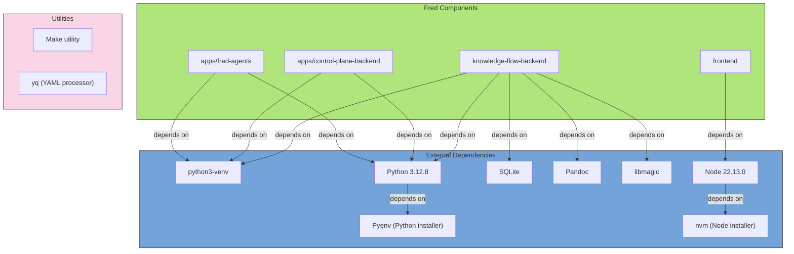

# Fred

> **IMPORTANT:** This project currently includes a dependency licensed under AGPL (GNU Affero General Public License). This library will be removed in an upcoming release. Until then, be aware that the AGPL terms may apply to deployments that use the affected component.

Two key references before diving in:

- [How do you test it?](docs/swift/TESTING.md) — clone, run, and know in five steps whether this checkout actually works
- [Who does what](https://github.com/orgs/ThalesGroup/projects/8/views/4)
- [Fred deployment factory](https://github.com/fred-agent/fred-deployment-factory)

> **Testing or developing locally? Don't stop after starting the apps.** Every
> tool and agent template is admin-gated by default now (CAPAB-01/CTRLP-14) —
> right after provisioning the demo platform, every team has an empty
> toolbox until an admin explicitly authorizes it. See
> [`TESTING.md`](docs/swift/TESTING.md) steps 3–4.

Fred is a production-ready platform for building and operating multi-agent AI applications. It has two complementary faces:

- **A hosted platform** — control plane, knowledge flow, chat frontend, auth, team access control, observability, and Kubernetes-ready deployment, all integrated and ready to use.
- **An open agent model** — a typed SDK and lightweight runtime that let teams ship independent agent pods, registered with the platform and operated alongside it without forking the core.

## How Fred is structured

Fred is built around three platform applications and a publishable SDK stack:

| Layer      | Package                                                     | Role                                                                                  |
| ---------- | ----------------------------------------------------------- | ------------------------------------------------------------------------------------- |
| Platform   | `apps/control-plane-backend`                                | Teams, sessions, agent enrollment, product APIs, `ExecutionGrant` issuance            |
| Platform   | `apps/knowledge-flow-backend`                               | Document ingestion, vectorization, retrieval                                          |
| Platform   | `frontend`                                                  | React chat UI (SSE streaming, rich markdown, math, Mermaid) and agent management UI   |
| Agent pods | `apps/fred-agents`                                          | First-party agent pod — the reference implementation and production execution surface |
| Agent pods | [fred-samples](https://github.com/ThalesGroup/fred-samples) | Example third-party pods — ship your own agents independently                         |
| Libraries  | `libs/fred-sdk`                                             | Agent authoring SDK — ReAct and graph agents, tools, HITL, execution contracts        |
| Libraries  | `libs/fred-runtime`                                         | Pod factory — FastAPI, SSE streaming, checkpointing, CLI (`fred-agents-cli`)          |
| Libraries  | `libs/fred-core`                                            | Shared infrastructure — SQL, KPI, security, config                                    |

**New to the codebase?** Open [`docs/ARCHITECTURE.html`](docs/ARCHITECTURE.html) in your browser for a guided architecture walkthrough — mental models, a 20-minute reading path, and the design decisions that explain everything else. _(GitHub shows raw HTML; open it locally or via VSCode Live Preview.)_

**The key design principle**: the control plane, knowledge flow backend, and frontend are the stable platform. Agent pods — `fred-agents` or any team's own pod built with `fred-sdk` + `fred-runtime` — are independently deployable and register themselves with the control plane. You can ship new agents without touching the platform.

> `agentic-backend` is still present during migration but no new features go there. Execution moves to `fred-agents` / `fred-runtime`; product/session/admin moves to `control-plane-backend`. See [`docs/backlog/BACKLOG.md`](./docs/swift/backlog/BACKLOG.md) for migration status.

See the project site: <https://fredk8.dev>

Contents:

- [Getting started](#getting-started)
  - [Development environment setup](#development-environment-setup)
    - [Option 1 (recommended): Let the Dev Container do it for you!](#option-1-recommended-let-the-dev-container-do-it-for-you)
    - [Option 2: Native mode i.e. install everything locally](#option-2-native-mode-ie-install-everything-locally)
    - [Advanced developer tips](#advanced-developer-tips)
  - [Model configuration](#model-configuration)
  - [Start Fred components](#start-fred-components)
  - [Head for the Fred UI!](#head-for-the-fred-ui)
- [k3d Local Deployment](#k3d-local-deployment)
- [Production mode](#production-mode)
- [Agent authoring (v2 SDK)](#agent-authoring-v2-sdk)
- [Agent coding academy](#agent-coding-academy)
- [Advanced configuration](#advanced-configuration)
- [Core Architecture and Licensing Clarity](#core-architecture-and-licensing-clarity)
- [Documentation](#documentation)
- [Contributing](#contributing)
- [Community](#community)
- [Contacts](#contacts)

## Getting started

To ensure a smooth first-time experience, Fred’s maintainers designed Dev Container/Native startup to require no additional external components (except, of course, to LLM APIs).

By default, using either Dev Container or native startup:

- Fred stores all data locally using **SQLite** for SQL/metadata and **ChromaDB** for vectors/embeddings. (DuckDB has been deprecated.) Data includes metrics, chat conversations, document uploads, and embeddings.
- Authentication and authorization are mocked.

> **Note:**  
> Accross all setup modes, a common requirement is to have access to Large Language Model (LLM) APIs via a model provider. Supported options include:
>
> - **Public OpenAI APIs:** Connect using your OpenAI API key.
> - **Private Ollama Server:** Host open-source models such as Mistral, Qwen, Gemma, and Phi locally or on a shared server.
> - **Private Azure AI Endpoints:** Connect using your Azure OpenAI key.
>
> Detailed instructions for configuring your chosen model provider are provided [below](#model-configuration).

### Development environment setup

Choose how you want to prepare Fred's development environment:

#### Option 1 (recommended): Let the Dev Container do it for you!

<details>
  <summary>Details</summary>

Prefer an isolated environment with everything pre-installed?

The Dev Container setup takes care of all dependencies related to knowledge-flow backend, control-plane backend, fred-agents pod, and frontend components.

##### Prerequisites

| Tool                                                                | Purpose                             |
| ------------------------------------------------------------------- | ----------------------------------- |
| **Docker** / Docker Desktop                                         | Runs the container                  |
| **VS Code**                                                         | Primary IDE                         |
| **Dev Containers extension** (`ms-vscode-remote.remote-containers`) | Opens the repo inside the container |

##### Open the container

1. Clone (or open) the repository in VS Code.
2. Press <kbd>F1</kbd> → **Dev Containers: Reopen in Container**.

When the terminal prompt appears, the workspace is ready but you still need to run the different services with `make run` as specified in the [next section](#start-fred-components). Ports `8000` (fred-agents pod), `8111` (Knowledge Flow backend), `8222` (Control Plane backend), and `5173` (Frontend) are automatically forwarded to the host.

##### Rebuilds & troubleshooting

- Rebuild the container: <kbd>F1</kbd> → _Dev Containers: Rebuild Container_
- Dependencies feel stale? Delete the relevant `.venv` or `frontend/node_modules` inside the container, then rerun the associated `make` target.
- Need to change API keys or models? Update the backend `.env` files inside the container and restart the relevant service. See [Model configuration](#model-configuration) for more details.

</details>

#### Option 2: Native mode i.e. install everything locally

<details>
  <summary>Details</summary>

> Note: Note that this native mode only applies to Unix-based OS (e.g., Mac or Linux-related OS).

##### Prerequisites

<details>
  <summary>First, make sure you have all the requirements installed</summary>

| Tool         | Type                             | Version                                                                                             | Install hint                                                                                |
| ------------ | -------------------------------- | --------------------------------------------------------------------------------------------------- | ------------------------------------------------------------------------------------------- |
| Pyenv        | Python installer                 | latest                                                                                              | [Pyenv installation instructions](https://github.com/pyenv/pyenv#installation)              |
| Python       | Programming language             | 3.12.8                                                                                              | Use `pyenv install 3.12.8`                                                                  |
| python3-venv | Python venv module/package       | matching                                                                                            | Bundled with Python 3 on most systems; otherwise `apt install python3-venv` (Debian/Ubuntu) |
| nvm          | Node installer                   | latest                                                                                              | [nvm installation instructions](https://github.com/nvm-sh/nvm#installing-and-updating)      |
| Node.js      | Programming language             | 22.13.0                                                                                             | Use `nvm install 22.13.0`                                                                   |
| Make         | Utility                          | system                                                                                              | Install via system package manager (e.g., `apt install make`, `brew install make`)          |
| yq           | Utility                          | system                                                                                              | Install via system package manager                                                          |
| SQLite       | Local RDBMS engine               | ≥ 3.35.0                                                                                            | Install via system package manager                                                          |
| Pandoc       | 2.9.2.1                          | [Pandoc installation instructions](https://pandoc.org/installing.html)                              | For DOCX document ingestion                                                                 |
| LibreOffice  | Headless doc converter           | [LibreOffice installation instructions](https://www.libreoffice.org/download/download-libreoffice/) | Required for PPTX vision enrichment (`pptx -> pdf`) via the `soffice` command               |
| libmagic     | Identifies file types by content | Install via system package manager (e.g., `apt install libmagic1`, `brew install libmagic`)         | To check file type                                                                          |

  <details>
    <summary>Dependency details</summary>



  </details>

</details>

##### Clone the repo

```bash
git clone https://github.com/ThalesGroup/fred.git
cd fred
```

> Note: the PPTX vision enrichment path in `knowledge-flow-backend` requires LibreOffice to be installed locally and the `soffice` command to be available in `PATH`. On Debian/Ubuntu, this can be installed with `apt install libreoffice`.

</details>

#### Advanced developer tips

> Prerequisites:
>
> - [Visual Studio Code](https://code.visualstudio.com/)
> - VS Code extensions:
>   - **Python** (ms-python.python)
>   - **Pylance** (ms-python.vscode-pylance)

To get full VS Code Python support (linting, IntelliSense, debugging, etc.) across our repo, we provide:

<details>
  <summary>1. A VS Code workspace file `fred.code-workspace` that loads all sub‑projects.</summary>

After cloning the repo, you can open Fred's VS Code workspace with `code .vscode/fred.code-workspace`

When you open Fred's VS Code workspace, VS Code will load these folders:

- `fred` – repo-wide files and scripts
- `apps/fred-agents` – first-party agent pod
- `apps/control-plane-backend` – control plane backend
- `knowledge-flow-backend` – knowledge flow backend
- `libs/fred-core`, `libs/fred-sdk`, `libs/fred-runtime` – shared libraries
- `frontend` – React UI
</details>

<details>
  <summary>2. Per‑folder `.vscode/settings.json` files in each Python backend to pin the interpreter.</summary>

Each backend ships its own virtual environment under .venv. We’ve added a per‑folder VS Code setting (see for instance `apps/fred-agents/.vscode/settings.json`) to automatically pick it:

This ensures that as soon as you open a Python file inside any backend or library folder, VS Code will:

- Activate that folder’s virtual environment
- Provide linting, IntelliSense, formatting, and debugging using the correct Python
</details>

### Model configuration

#### Model configuration (Agent pods)

Model configuration for agent pods lives in **`apps/fred-agents/config/models_catalog.yaml`** (and equivalently in any third-party pod). This file is separate from `configuration.yaml` and owns the full model setup: named profiles, provider settings, shared HTTP client limits, and routing rules.

**Profiles** are named model configurations. Each profile declares a provider, a model name, and optional settings (temperature, timeouts, retries). Profiles are referenced by `profile_id`.

**Defaults** declare which profile to use per capability when no rule matches:

```yaml
default_profile_by_capability:
  chat: default.chat.openai.prod
  language: default.language.openai.prod
```

**Routing rules** allow policy-based model selection based on team, agent, or operation context. Rules are evaluated in order; the first match wins:

```yaml
rules:
  - rule_id: team-a-uses-ollama
    capability: chat
    team_id: team-a
    operation: routing
    target_profile_id: chat.ollama.mistral

  - rule_id: graph-g1-json-validation
    capability: chat
    agent_id: internal.graph.g1
    operation: json_validation_fc
    target_profile_id: chat.azure_apim.gpt4o
```

This makes it possible to route different teams, agents, or operation types to different models — including mixing providers — without changing any agent code.

For details on all supported match criteria (`team_id`, `agent_id`, `user_id`, `operation`, `purpose`) see [`docs/platform/LLM_ROUTING_FRED.md`](./docs/swift/platform/LLM_ROUTING_FRED.md).

#### Set it up according to your development environment

All backends rely on `.env` files for secrets and `configuration.yaml` / `models_catalog.yaml` for settings:

- fred-agents pod: `apps/fred-agents/config/.env`, `configuration.yaml`, and `models_catalog.yaml`
- Knowledge Flow backend: `apps/knowledge-flow-backend/config/.env` and `configuration.yaml`
- Control Plane backend: `apps/control-plane-backend/config/.env` and `configuration.yaml`

1. **Copy the templates (skip if they already exist).**

   ```bash
   cp apps/fred-agents/config/.env.template apps/fred-agents/config/.env
   cp apps/knowledge-flow-backend/config/.env.template apps/knowledge-flow-backend/config/.env
   cp apps/control-plane-backend/config/.env.template apps/control-plane-backend/config/.env
   ```

2. **Edit the `.env` files** to set the API keys, base URLs, and deployment names that match your model provider.

3. **Update each backend’s `configuration.yaml`** so the `provider`, `name`, and optional settings align with the same provider. Use the recipes below as a starting point.

<details>
  <summary>OpenAI</summary>

> **Note:** Out of the box, Fred is configured to use OpenAI public APIs with the following models:
>
> - fred-agents pod: chat model `gpt-4o` (or whatever profile is set as default in `models_catalog.yaml`)
> - knowledge flow backend: chat model `gpt-4o-mini` and embedding model `text-embedding-3-large`
>
> If you plan to use Fred with these OpenAI models, you don't have to perform the `yq` commands below—just make sure the `.env` files contain your key.

- fred-agents pod configuration

  Edit `apps/fred-agents/config/models_catalog.yaml`. Find the profile you want to use (or add one) and set `provider: openai` and `name: <your-openai-model-name>`. Then set it as the `default_profile_by_capability.chat` default.

- knowledge flow backend configuration
  - Chat model

    ```bash
    yq eval '.chat_model.provider = "openai"' -i apps/knowledge-flow-backend/config/configuration.yaml
    yq eval '.chat_model.name = "<your-openai-model-name>"' -i apps/knowledge-flow-backend/config/configuration.yaml
    yq eval 'del(.chat_model.settings)' -i apps/knowledge-flow-backend/config/configuration.yaml
    ```

  - Embedding model

    ```bash
    yq eval '.embedding_model.provider = "openai"' -i apps/knowledge-flow-backend/config/configuration.yaml
    yq eval '.embedding_model.name = "<your-openai-model-name>"' -i apps/knowledge-flow-backend/config/configuration.yaml
    yq eval 'del(.embedding_model.settings)' -i apps/knowledge-flow-backend/config/configuration.yaml
    ```

- Copy-paste your `OPENAI_API_KEY` value in both `.env` files.

  > ⚠️ An `OPENAI_API_KEY` from a free OpenAI account unfortunately does not work.

</details>

<details>
  <summary>Azure OpenAI</summary>

- fred-agents pod configuration

  Edit `apps/fred-agents/config/models_catalog.yaml`. Find or add a profile with `provider: azure-openai`, `name: <deployment-name>`, and `settings.azure_endpoint` / `settings.azure_openai_api_version`. Set it as the `default_profile_by_capability.chat` default.

- knowledge flow backend configuration
  - Chat model

    ```bash
    yq eval '.chat_model.provider = "azure-openai"' -i apps/knowledge-flow-backend/config/configuration.yaml
    yq eval '.chat_model.name = "<your-azure-openai-deployment-name>"' -i apps/knowledge-flow-backend/config/configuration.yaml
    yq eval 'del(.chat_model.settings)' -i apps/knowledge-flow-backend/config/configuration.yaml
    yq eval '.chat_model.settings.azure_endpoint = "<your-azure-openai-endpoint>"' -i apps/knowledge-flow-backend/config/configuration.yaml
    yq eval '.chat_model.settings.azure_openai_api_version = "<your-azure-openai-api-version>"' -i apps/knowledge-flow-backend/config/configuration.yaml
    ```

  - Embedding model

    ```bash
    yq eval '.embedding_model.provider = "azure-openai"' -i apps/knowledge-flow-backend/config/configuration.yaml
    yq eval '.embedding_model.name = "<your-azure-openai-deployment-name>"' -i apps/knowledge-flow-backend/config/configuration.yaml
    yq eval 'del(.embedding_model.settings)' -i apps/knowledge-flow-backend/config/configuration.yaml
    yq eval '.embedding_model.settings.azure_endpoint = "<your-azure-openai-endpoint>"' -i apps/knowledge-flow-backend/config/configuration.yaml
    yq eval '.embedding_model.settings.azure_openai_api_version = "<your-azure-openai-api-version>"' -i apps/knowledge-flow-backend/config/configuration.yaml
    ```

  - Vision model

    ```bash
    yq eval '.vision_model.provider = "azure-openai"' -i knowledge_flow_backend/config/configuration.yaml
    yq eval '.vision_model.name = "<your-azure-openai-deployment-name>"' -i knowledge_flow_backend/config/configuration.yaml
    yq eval 'del(.vision_model.settings)' -i knowledge_flow_backend/config/configuration.yaml
    yq eval '.vision_model.settings.azure_endpoint = "<your-azure-openai-endpoint>"' -i knowledge_flow_backend/config/configuration.yaml
    yq eval '.vision_model.settings.azure_openai_api_version = "<your-azure-openai-api-version>"' -i knowledge_flow_backend/config/configuration.yaml
    ```

- Copy-paste your `AZURE_OPENAI_API_KEY` value in both `.env` files.

</details>

<details>
  <summary>Ollama</summary>

- fred-agents pod configuration

  Edit `apps/fred-agents/config/models_catalog.yaml`. Add or update a profile with `provider: openai`, `name: <your-ollama-model-name>`, and `settings.base_url: <your-ollama-endpoint>`. Set it as the `default_profile_by_capability.chat` default.

- knowledge flow backend configuration
  - Chat model

    ```bash
    yq eval '.chat_model.provider = "ollama"' -i apps/knowledge-flow-backend/config/configuration.yaml
    yq eval '.chat_model.name = "<your-ollama-model-name>"' -i apps/knowledge-flow-backend/config/configuration.yaml
    yq eval 'del(.chat_model.settings)' -i apps/knowledge-flow-backend/config/configuration.yaml
    yq eval '.chat_model.settings.base_url = "<your-ollama-endpoint>"' -i apps/knowledge-flow-backend/config/configuration.yaml
    ```

  - Embedding model

    ```bash
    yq eval '.embedding_model.provider = "ollama"' -i apps/knowledge-flow-backend/config/configuration.yaml
    yq eval '.embedding_model.name = "<your-ollama-model-name>"' -i apps/knowledge-flow-backend/config/configuration.yaml
    yq eval 'del(.embedding_model.settings)' -i apps/knowledge-flow-backend/config/configuration.yaml
    yq eval '.embedding_model.settings.base_url = "<your-ollama-endpoint>"' -i apps/knowledge-flow-backend/config/configuration.yaml
    ```

</details>

<details>
  <summary>Azure OpenAI via Azure APIM</summary>

- fred-agents pod configuration

  Edit `apps/fred-agents/config/models_catalog.yaml`. Add or update a profile with `provider: azure-apim` and the required `settings` fields (`azure_ad_client_id`, `azure_ad_client_scope`, `azure_apim_base_url`, `azure_apim_resource_path`, `azure_openai_api_version`, `azure_tenant_id`). Set it as the default profile.

- knowledge flow backend configuration
  - Chat model

    ```bash
    yq eval '.chat_model.provider = "azure-apim"' -i apps/knowledge-flow-backend/config/configuration.yaml
    yq eval '.chat_model.name = "<your-azure-openai-deployment-name>"' -i apps/knowledge-flow-backend/config/configuration.yaml
    yq eval 'del(.chat_model.settings)' -i apps/knowledge-flow-backend/config/configuration.yaml
    yq eval '.chat_model.settings.azure_ad_client_id = "<your-azure-apim-client-id>"' -i apps/knowledge-flow-backend/config/configuration.yaml
    yq eval '.chat_model.settings.azure_ad_client_scope = "<your-azure-apim-client-scope>"' -i apps/knowledge-flow-backend/config/configuration.yaml
    yq eval '.chat_model.settings.azure_apim_base_url = "<your-azure-apim-endpoint>"' -i apps/knowledge-flow-backend/config/configuration.yaml
    yq eval '.chat_model.settings.azure_apim_resource_path = "<your-azure-apim-resource-path>"' -i apps/knowledge-flow-backend/config/configuration.yaml
    yq eval '.chat_model.settings.azure_openai_api_version = "<your-azure-openai-api-version>"' -i apps/knowledge-flow-backend/config/configuration.yaml
    yq eval '.chat_model.settings.azure_tenant_id = "<your-azure-tenant-id>"' -i apps/knowledge-flow-backend/config/configuration.yaml
    ```

  - Embedding model

    ```bash
    yq eval '.embedding_model.provider = "azure-apim"' -i apps/knowledge-flow-backend/config/configuration.yaml
    yq eval '.embedding_model.name = "<your-azure-openai-deployment-name>"' -i apps/knowledge-flow-backend/config/configuration.yaml
    yq eval 'del(.embedding_model.settings)' -i apps/knowledge-flow-backend/config/configuration.yaml
    yq eval '.embedding_model.settings.azure_ad_client_id = "<your-azure-apim-client-id>"' -i apps/knowledge-flow-backend/config/configuration.yaml
    yq eval '.embedding_model.settings.azure_ad_client_scope = "<your-azure-apim-client-scope>"' -i apps/knowledge-flow-backend/config/configuration.yaml
    yq eval '.embedding_model.settings.azure_apim_base_url = "<your-azure-apim-endpoint>"' -i apps/knowledge-flow-backend/config/configuration.yaml
    yq eval '.embedding_model.settings.azure_apim_resource_path = "<your-azure-apim-resource-path>"' -i apps/knowledge-flow-backend/config/configuration.yaml
    yq eval '.embedding_model.settings.azure_openai_api_version = "<your-azure-openai-api-version>"' -i apps/knowledge-flow-backend/config/configuration.yaml
    yq eval '.embedding_model.settings.azure_tenant_id = "<your-azure-tenant-id>"' -i apps/knowledge-flow-backend/config/configuration.yaml
    ```

- Copy-paste your `AZURE_AD_CLIENT_SECRET` and `AZURE_APIM_SUBSCRIPTION_KEY` values in both `.env` files.

</details>

### Start Fred components

```bash
# standalone mode (single-process backend: control-plane + agentic + knowledge-flow)
make run-app
```

```bash
# split APIs mode (agentic:8000, knowledge-flow:8111, control-plane:8222)
make run-multi
```

```bash
# default command (alias of `run-app`)
make run
```

```bash
# backward-compatible alias
make run-app-multi
```

```bash
# split APIs mode + all Temporal workers (requires Temporal running)
make run-multi-workers
```

Run a single backend API from repository root:

```bash
make run-control-plane
make run-fred-agents
make run-knowledge-flow
```

Or run each component from its own folder:

```bash
# knowledge-flow backend
cd apps/knowledge-flow-backend && make run
```

```bash
# fred-agents pod
cd apps/fred-agents && make run
```

```bash
# control-plane backend
cd apps/control-plane-backend && make run
```

```bash
# frontend
cd frontend && make run
```

### Head for the Fred UI!

Open <http://localhost:5173> in your browser.

## k3d Local Deployment

Fred can be deployed locally into a [k3d](https://k3d.io) Kubernetes cluster using Helm. This mode mirrors a production-like setup while keeping everything on your machine.

### Prerequisites

| Tool        | Purpose                    | Install                                                                        |
| ----------- | -------------------------- | ------------------------------------------------------------------------------ |
| **Docker**  | Container runtime          | [docs](https://docs.docker.com/get-docker/)                                    |
| **k3d**     | Local Kubernetes clusters  | `curl -s https://raw.githubusercontent.com/k3d-io/k3d/main/install.sh \| bash` |
| **Helm**    | Kubernetes package manager | [docs](https://helm.sh/docs/intro/install/)                                    |
| **kubectl** | Kubernetes CLI             | [docs](https://kubernetes.io/docs/tasks/tools/)                                |

You also need the infrastructure stack deployed via the [fred-deployment-factory](https://github.com/ThalesGroup/fred-deployment-factory) repository. Follow its README to run `make k3d-up`.

### Host Configuration

> [!IMPORTANT]
> You **must** add `keycloak` to your `/etc/hosts` file so your browser can reach the Keycloak server running inside k3d:
>
> ```
> 127.0.0.1 localhost keycloak
> ```
>
> Without this entry, authentication will not work because the browser cannot resolve the `keycloak` hostname.

### Deploying

```bash
# 1. Set your OpenAI API key in the values file
#    Edit deploy/local/k3d/values-local.yaml and fill OPENAI_API_KEY

# 2. Build, import images into k3d, and deploy via Helm (all-in-one)
make k3d-deploy
```

### Makefile Targets

| Target                      | Description                                                                                                 |
| --------------------------- | ----------------------------------------------------------------------------------------------------------- |
| `make k3d-build`            | Build Docker images for all services (fred-agents, knowledge-flow-backend, control-plane-backend, frontend) |
| `make k3d-import`           | Import built images into the k3d cluster                                                                    |
| `make k3d-deploy`           | All-in-one: build + import + deploy                                                                         |
| `make k3d-deploy-only`      | Deploy/upgrade the Helm chart only (images must already be imported)                                        |
| `make k3d-undeploy`         | Uninstall the Helm release                                                                                  |
| `make k3d-status`           | Show pod and service status in the `fred` namespace                                                         |
| `make k3d-logs-fred-agents` | Tail logs for the fred-agents pod                                                                           |
| `make k3d-logs-kf`          | Tail logs for the knowledge-flow-backend                                                                    |
| `make k3d-logs-frontend`    | Tail logs for the frontend                                                                                  |

### Accessing the Application

Once deployed, open <http://localhost:8088> in your browser. The Traefik Ingress routes all traffic through a single port:

| Path                | Service                   |
| ------------------- | ------------------------- |
| `/`                 | Frontend                  |
| `/fred/agents/v2/*` | fred-agents pod           |
| `/knowledge-flow/*` | Knowledge Flow backend    |
| `/control-plane/*`  | Control Plane backend     |
| `/realms/*`         | Keycloak (authentication) |

Other infrastructure services remain accessible on their usual ports:

| Service               | URL                     |
| --------------------- | ----------------------- |
| Keycloak              | <http://keycloak:8080>  |
| Temporal UI           | <http://localhost:8233> |
| MinIO Console         | <http://localhost:9001> |
| OpenSearch Dashboards | <http://localhost:5601> |

## Production mode

> [!IMPORTANT]
> **Access-control reminder (shared environments):**
> Keycloak app roles and team ReBAC rights are different controls.
> For the Fred access model and deployment bootstrap rules, see [`docs/platform/REBAC.md`](./docs/swift/platform/REBAC.md).

For production deployments (Kubernetes, VMs, on-prem or cloud), refer to:

- [`docs/platform/DEPLOYMENT_GUIDE.md`](./docs/swift/platform/DEPLOYMENT_GUIDE.md) – high-level deployment guide (components, configuration, external dependencies).
- [`docs/platform/DEPLOYMENT_GUIDE_OPENSEARCH.md`](./docs/swift/platform/DEPLOYMENT_GUIDE_OPENSEARCH.md) – OpenSearch-specific requirements. Use this only if you choose OpenSearch over the new PostgreSQL/pgvector option.
- [`docs/platform/REBAC.md`](./docs/swift/platform/REBAC.md) – high-level access model (RBAC/ReBAC/organization/bootstrap).

The rest of this `README.md` focuses on local developer setup and model configuration.

## Agent authoring (v2 SDK)

Fred includes a structured agent authoring SDK designed for domain engineers and platform teams who need to write reliable, testable agents without re-implementing execution infrastructure.

The v2 SDK provides two authoring styles:

- **ReAct / profile agents** — for focused, tool-driven agents with a small state surface. Declare a role, a tool set, and a few instructions. The SDK owns the execution loop.
- **Graph agents** — for multi-step business workflows with explicit state, conditional routing, and human-in-the-loop confirmation gates. The business flow is expressed as a typed graph; the SDK handles streaming, checkpointing, and HITL interrupts.

Both styles support MCP tool integration and run on the same runtime.

Start with the [agent authoring guide (v2)](./docs/swift/authoring/AGENTS.md). For the design philosophy behind the SDK, see [SDK V2 positioning](./docs/swift/authoring/SDK-V2-POSITIONING.md).

## Agent coding academy

The [academy](./academy/README.md) contains sample MCP servers and standalone applications to experiment with agent development outside the main platform. The [fred-samples](https://github.com/ThalesGroup/fred-samples) repository provides ready-to-run example pods built with `fred-sdk` + `fred-runtime`.

## Advanced configuration

### System Architecture

**Platform applications:**

| Component              | Location                       | Role                                                                              |
| ---------------------- | ------------------------------ | --------------------------------------------------------------------------------- |
| Frontend UI            | `./frontend`                   | React chat UI (SSE streaming, rich markdown/math/Mermaid) and agent management UI |
| Knowledge Flow backend | `./apps/knowledge-flow-backend` | Document ingestion, vectorization, and retrieval                                  |
| Control Plane backend  | `./apps/control-plane-backend` | Teams, users, agent enrollment, session metadata, `ExecutionGrant` issuance       |

**Agent pods:**

| Component    | Location             | Role                                                                                 |
| ------------ | -------------------- | ------------------------------------------------------------------------------------ |
| fred-agents  | `./apps/fred-agents` | First-party agent pod — reference implementation and production execution surface    |
| _(your pod)_ | your repo            | Any pod built with `fred-sdk` + `fred-runtime` and registered with the control plane |

**Shared libraries (published to PyPI):**

| Component    | Location              | Role                                                     |
| ------------ | --------------------- | -------------------------------------------------------- |
| fred-core    | `./libs/fred-core`    | Shared infrastructure — SQL, KPI, security, config       |
| fred-sdk     | `./libs/fred-sdk`     | Agent authoring SDK — contracts, graph, tools, HITL      |
| fred-runtime | `./libs/fred-runtime` | Pod factory — FastAPI, SSE streaming, checkpointing, CLI |

> `agentic-backend` (`./agentic-backend`) remains during migration. Do not add new features there.

### Configuration Files

| File                                                   | Purpose                                                       | Tip                                                            |
| ------------------------------------------------------ | ------------------------------------------------------------- | -------------------------------------------------------------- |
| `apps/fred-agents/config/.env`                         | Secrets (API keys, passwords). Not committed to Git.          | Copy `.env.template` to `.env` and fill in any missing values. |
| `apps/knowledge-flow-backend/config/.env`                   | Same as above                                                 | Same as above                                                  |
| `apps/control-plane-backend/config/.env`               | Same as above                                                 | Same as above                                                  |
| `apps/fred-agents/config/models_catalog.yaml`          | Model profiles, routing rules, provider settings for the pod. | Edit profiles and set `default_profile_by_capability`.         |
| `apps/fred-agents/config/configuration.yaml`           | Pod runtime settings (base URL, feature flags, MCP catalog).  | -                                                              |
| `apps/knowledge-flow-backend/config/configuration.yaml`     | Chat/embedding/vision model settings, ingestion options.      | -                                                              |
| `apps/control-plane-backend/config/configuration.yaml` | Team/user policy settings, runtime catalog sources.           | -                                                              |

### Supported Model Providers

| Provider                    | How to enable                                                                                                     |
| --------------------------- | ----------------------------------------------------------------------------------------------------------------- |
| OpenAI (default)            | Add `OPENAI_API_KEY` to `apps/fred-agents/config/.env`; add a profile in `models_catalog.yaml`                    |
| Azure OpenAI                | Add `AZURE_OPENAI_API_KEY` to `.env`; add a profile with `provider: azure-openai` in `models_catalog.yaml`        |
| Azure OpenAI via Azure APIM | Add `AZURE_APIM_SUBSCRIPTION_KEY` and `AZURE_AD_CLIENT_SECRET` to `.env`; add profile with `provider: azure-apim` |
| Ollama (local models)       | Add a profile with `provider: openai` and `settings.base_url: <ollama-endpoint>` in `models_catalog.yaml`         |

See `apps/fred-agents/config/models_catalog.yaml` and `apps/knowledge-flow-backend/config/configuration.yaml` (sections `chat_model:` and `embedding_model:`) for concrete examples. Full routing documentation: [`docs/platform/LLM_ROUTING_FRED.md`](./docs/swift/platform/LLM_ROUTING_FRED.md).

### Advanced Integrations

- Enable Keycloak or another OIDC provider for authentication

  > **Frontend security is backend-driven.**  
  > The frontend first loads static `/config.json`, then calls the public control-plane `/control-plane/v1/frontend/config` endpoint for the effective `user_auth` and `gcu_version` values. Real Keycloak OIDC is enabled from the backend `security.user` configuration; when disabled for local dev, the frontend mints local dev tokens while keeping the same app code paths. Static branding stays in frontend `config.json` `properties`. See [`apps/frontend/README.md`](./apps/frontend/README.md#configuration-surfaces) for details.

- Persistence options:
  - **Laptop / dev (default):** SQLite for metadata + ChromaDB for vectors (embedded, no external services)
  - **Production:** PostgreSQL + pgvector for metadata/vectors, and optionally MinIO/S3 + OpenSearch if you prefer that stack

## Core Architecture and Licensing Clarity

The platform applications and the fred-agents pod form the default Fred deployment. By default they run self-contained on a laptop using **SQLite + ChromaDB** (no external services).

Fred is modular: you can optionally add Keycloak/OpenFGA, MinIO/S3, OpenSearch, and PostgreSQL/pgvector for production-grade persistence.

Persistence options:

- **Dev/laptop (default):** SQLite for all SQL stores, ChromaDB for vectors, local filesystem for blobs.
- **Production (recommended):** PostgreSQL + pgvector for SQL + vectors; optionally pair with MinIO/S3 + OpenSearch if you prefer that stack.

## Documentation

- Generic information
  - [Main docs](https://fredk8.dev/docs)
  - [Features overview](./docs/swift/platform/FEATURES.md)

- fred-agents pod and runtime libraries
  - [fred-agents README](./apps/fred-agents/README.md)
  - [fred-runtime (pod factory)](./libs/fred-runtime/)
  - [fred-sdk (authoring SDK)](./libs/fred-sdk/)
  - [fred-core (shared infrastructure)](./libs/fred-core/)

- Agent authoring (v2 SDK)
  - [Agent authoring guide (v2)](./docs/swift/authoring/AGENTS.md)
  - [SDK V2 positioning — design philosophy](./docs/swift/authoring/SDK-V2-POSITIONING.md)
  - [V2 agent creation — React vs Graph](./docs/swift/platform/V2_AGENT_CREATION.md)

- Architecture RFCs
  - [SDK V2 for industrial-grade agents](./docs/swift/rfc/SDK-V2-RFC.md)
  - [Distributed agent architecture](./docs/swift/rfc/DISTRIBUTED-AGENT-ARCHITECTURE-RFC.md)

- Knowledge Flow backend
  - [Knowledge Flow backend README](./apps/knowledge-flow-backend/README.md)

- Frontend
  - [Frontend README](./frontend/README.md)

- Security-related topics
  - [Security overview](./docs/swift/platform/SECURITY.md)
  - [Keycloak](./docs/swift/platform/KEYCLOAK.md)

- Developer and contributors guides
  - [Developer Contract (humans + AI)](./docs/swift/platform/DEVELOPER_CONTRACT.md)
  - [Platform Runtime Map (API apps + Temporal apps)](./docs/swift/platform/PLATFORM_RUNTIME_MAP.md)
  - [Developer Tools](./developer_tools/README.md)
  - [Code of Conduct](./docs/swift/CODE_OF_CONDUCT.md)
  - [Python Coding Guide](./docs/swift/platform/PYTHON_CODING_GUIDELINES.md)
  - [Contributing](./docs/swift/CONTRIBUTING.md)

### Licensing Note

Fred's own code is released under the **Apache License 2.0**. Optional integrations (like OpenSearch) are configured externally and do not contaminate Fred's licensing.

Fred currently depends on a small number of third-party Python packages under copyleft licenses, tracked under `LICENSE-01`/`LICENSE-02`/`LICENSE-03` (see `docs/swift/data/id-legend.yaml`). Full detail, severity assessment, and remediation status for each: [docs/swift/COPYLEFT-DEPENDENCIES.md](./docs/swift/COPYLEFT-DEPENDENCIES.md).

- `pymupdf` / `pymupdf4llm` (PDF processing, `knowledge-flow-backend`) — dual-licensed **AGPL-3.0 / Artifex Commercial License**. An **optional, opt-in extra** (`pip install knowledge-flow-backend[pymupdf]` / `uv sync --extra pymupdf`), never installed by the default `uv sync`, Docker image, or PyPI install. The default PDF pipeline uses `docling`/`pypdf`/`pypdfium2` and ships with no AGPL code (fixed in [issue #1950](https://github.com/ThalesGroup/fred/issues/1950)).
- `psycopg2-binary` / `psycopg` (PostgreSQL driver, `fred-core` / `knowledge-flow-backend`) — **LGPL-3.0-only**, used as an unmodified, dynamically imported package (not statically linked or embedded).
- `jwcrypto` (transitive, via `python-keycloak`'s admin client, `fred-core` / `control-plane-backend` / `knowledge-flow-backend` / `fred-agents`) — **LGPL-3.0-or-later**, used as an unmodified, dynamically imported package; never directly invoked by Fred's own code (Fred's JWT verification path uses PyJWT).

The default Fred distribution — default `uv sync`, default Docker image, default PyPI install — contains no AGPL code. If your use case requires a fully copyleft-free dependency tree end to end (including the LGPL packages above), audit them before deployment.

See the [LICENSE](LICENSE.md) for more details.

## Contributing

We welcome pull requests and issues. Start with the [Contributing guide](./CONTRIBUTING.md).

## Community

Join the discussion on our [Discord server](https://discord.gg/F6qh4Bnk)!

[](https://discord.gg/F6qh4Bnk)

## Contacts

- <dimitri.tombroff@thalesgroup.com>
- <simon.cariou@thalesgroup.com>
- <sebastien.ehling@thalesgroup.com>
- <florian.muller@thalesgroup.com>
