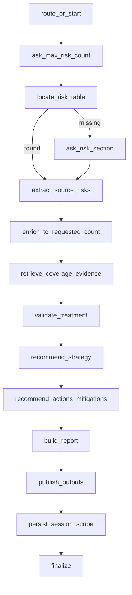

# DVARiskValidatorGraph

Graph agent that validates DVA risks, evidence, and treatment coverage.

```mermaid
graph TD
    A[route_or_start] --> B[ask_max_risk_count]
    B --> C[locate_risk_table]
    C -->|found| D[extract_source_risks]
    C -->|missing| E[ask_risk_section]
    E --> D
    D --> F[enrich_to_requested_count]
    F --> G[retrieve_coverage_evidence]
    G --> H[validate_treatment]
    H --> I[recommend_strategy]
    I --> J[recommend_actions_mitigations]
    J --> K[build_report]
    K --> L[publish_outputs]
    L --> M[persist_session_scope]
    M --> N[finalize]
```
