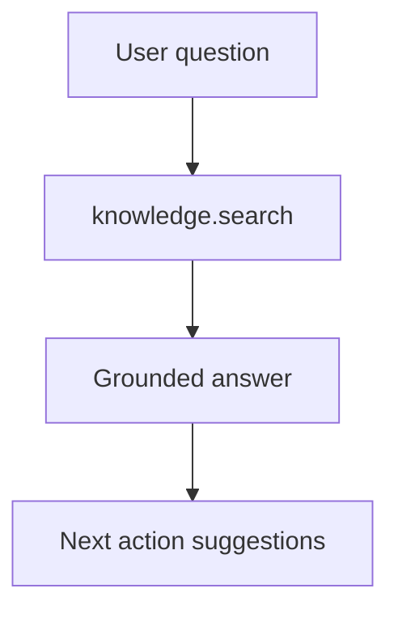

# DVARiskValidatorQA

ReAct Q&A assistant grounded on the DVA and the generated validation report.

```mermaid
graph TD
    A[User question] --> B[knowledge.search]
    B --> C[Grounded answer]
    C --> D[Next action suggestions]
```
