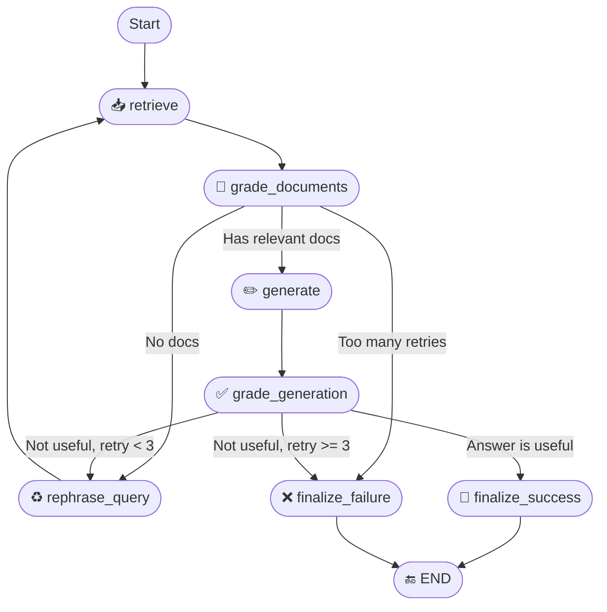

# Agent Design Note

## 🎯 Purpose

`RagsExpert` is a RAG (Retrieval-Augmented Generation) agent designed to answer questions using documents retrieved from a vector search service (`knowledge-flow`). It extracts, filters, and synthesizes document content to generate accurate answers with citations. It can also reformulate queries to improve retrieval quality.

---

## 🧩 Agent Structure

### Key Fields

- **`name` / `role` / `nickname` / `description`**: Metadata that describe the agent.
- **`categories` / `tag`**: Classification tags for categorizing the agent.
- **`agent_settings`**: Configuration object (e.g. model name, vector search URL).
- **`TOP_K`**: Number of documents to retrieve initially (default: 4).
- **`model`**: The LLM used for reasoning, generation, grading, and rewriting.

---

## 🛠 Initialization (Async)

The `async_init` method bootstraps the agent asynchronously:

- Loads the language model via `get_model(...)`.
- Builds the base prompt (`_generate_prompt()`).
- Constructs the LangGraph (`_build_graph()`).
- Calls the `AgentFlow` constructor with all metadata and graph logic.

---

## 🔄 Graph Logic

The agent uses a `StateGraph[RagGraphState]` with the following nodes and transitions:



---

## 🧠 Reasoning Logic

### 1. **Document Grading** (`_grade_documents`)
Each retrieved document is graded with a binary “yes” / “no” score using a prompt. Documents graded “no” are filtered out.

### 2. **Answer Grading** (`_grade_generation`)
The generated answer is evaluated for usefulness:
- If useful → `finalize_success`
- If not useful and retry count < 3 → `rephrase_query`
- If retry count ≥ 3 → `finalize_failure`

### 3. **Query Rephrasing** (`_rephrase_query`)
When no relevant documents are found or an answer is not useful, the question is reformulated to improve retrieval performance.

---

## 📋 Prompt Design

### 🔹 Base Prompt
Sets the role and context for the agent:

```text
You are responsible for analyzing document parts and answering questions based on them.
Whenever you reference a document part, provide citations.
The current date is {YYYY-MM-DD}.
```

### 🔹 Specialized Prompts

| Purpose              | Prompt Content                                                             | Output Schema            |
|----------------------|----------------------------------------------------------------------------|---------------------------|
| Grade Document       | Relevance of a retrieved document to the question                          | `GradeDocumentsOutput`   |
| Generate Answer      | Create answer from selected documents with citations                       | `AIMessage`              |
| Rephrase Query       | Rewrite user question for better vector retrieval                          | `RephraseQueryOutput`    |
| Grade Generation     | Assess if answer resolves the original question                            | `GradeAnswerOutput`      |

---

## ✅ Summary

- 🔍 Vector-based document retrieval
- ⚖️ Relevance grading for filtering noise
- 🔁 Intelligent rephrasing with retry logic
- 🤖 Answer generation with citation formatting
- ✅ Self-reflective answer validation
- 🧱 Modular and extensible LangGraph-based design

---

## 📦 Reusability Tip

To reuse this agent pattern in other domains:

- Extract and generalize grading and rephrasing chains as shared utilities.
- Parameterize `TOP_K`, vector search endpoint, and model settings.
- Make prompt templates configurable or externalized.
- Plug in alternative retrievers (e.g., hybrid search, OpenSearch).
- Extend document formatting logic to support tables, metadata, or structured schemas.

---
