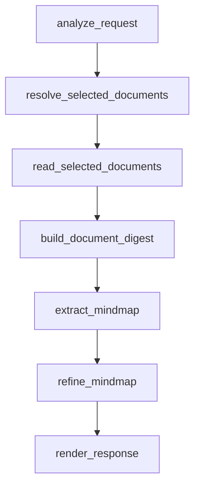

# Mindmap — selected-document transcript visualizer

Mindmap is a **GraphAgent** that turns transcript or script documents selected
with Fred's **Documents** picker into a structured `mindmap-json` block for
frontend rendering.

## Workflow



## What it does

- Uses the Fred **Documents** picker and reads `runtime_context.selected_document_uids`
- Reads each selected document through bounded Knowledge Flow filesystem pagination
  on `/corpus/documents/{document_uid}/preview.md`
- Summarizes transcript pages incrementally instead of concatenating full
  document previews into one prompt
- Merges page summaries into a global digest that preserves concrete transcript
  sections such as implementation details, risks, tests, acceptance criteria,
  and roadmap items when present
- Extracts a hierarchical mindmap payload
- Returns a valid `mindmap-json` fenced block for custom frontend rendering
- Defaults to `initialDepth: 2`, `layout: "orthogonal"`, `max_depth: 4`, and
  `max_children_per_node: 8` for richer first-screen coverage

## Runtime dependencies

- `MCP_SERVER_KNOWLEDGE_FLOW_TEXT`
- `MCP_SERVER_KNOWLEDGE_FLOW_FS`

`knowledge.search` is kept only as an explicit fallback path and is disabled by
default. The normal mode is strict selected-document reading.

## User flow

1. The user selects one or more transcript/script documents with the
   **Documents** picker.
2. The runtime passes those ids in `selected_document_uids`.
3. The agent reads the selected document previews page by page with
   `read_file_page`.
4. The agent summarizes pages, merges the summaries into one digest, and
   generates the final mindmap with concrete transcript branches instead of
   generic labels whenever the source supports them.

If no document is selected, the agent returns a message asking the user to use
the **Documents** picker before trying again.

## How to run locally

```bash
cd apps/fred-agents
make run
```

Then select the agent in chat:

```text
/agent fred.dt.mindmap.graph
```

## Frontend expectation

This backend returns:

```text
```mindmap-json
{ ...valid JSON payload... }
```
```

The Fred frontend can then detect `mindmap-json` fences and render them with a
custom ECharts tree block.

## Validation

```bash
cd apps/fred-agents
make code-quality
make test
```
