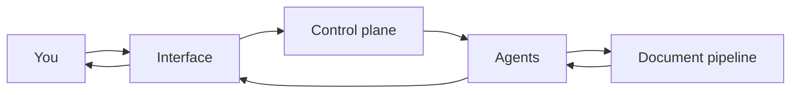

# Technical architecture

This section explains, without needless jargon, how the platform is built. It's
for a reader curious about the inner workings; it isn't required for everyday
use.

## The building blocks

The platform is organized into a few complementary components:

- **The interface**: what you see in the browser.
- **The control plane**: manages teams, sessions, prompts, and permissions —
  everything about organization and access.
- **The agents**: run conversations, call on capabilities, and invoke language
  models.
- **The document pipeline**: ingests your documents, indexes them, and enables
  their search.

## The path of a question

You ask a question in the interface; the control plane checks your permissions
and routes the request; the agent builds the answer, querying the document
pipeline when needed to retrieve and cite your sources; the answer comes back to
you in the interface.

## Going further

- [Security and permissions](/help/en/architecture/security)
- [Where data lives](/help/en/architecture/data-storage)
