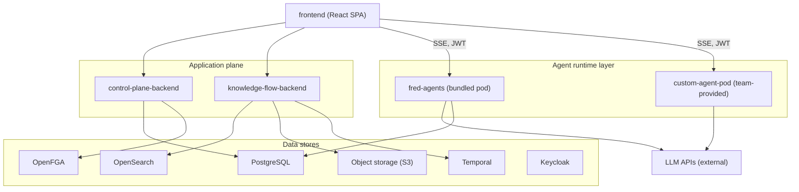
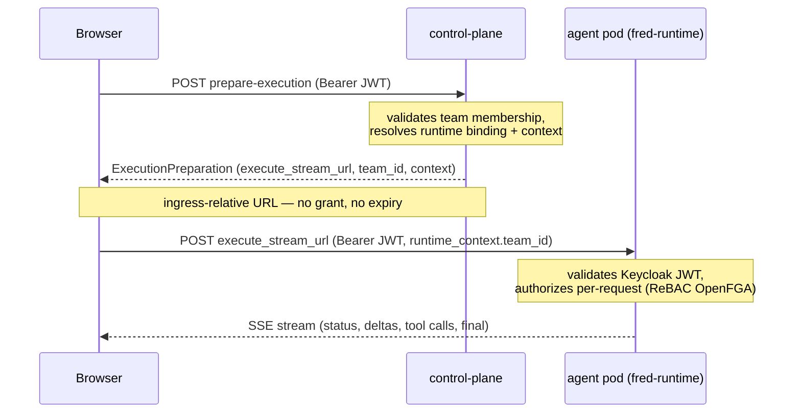

# Technical architecture

This section describes the platform's **logical architecture**: the components,
their responsibilities, how they communicate, and the security model that ties
them together.

> **Intended audience.** Unlike the rest of this help center, this section is
> written for technical profiles — IT engineers, architects, data scientists,
> developers. The vocabulary is precise and components are referred to by their
> original names (`control-plane`, `knowledge-flow`, `fred-agents`, `OpenFGA`,
> `Keycloak`…).

## Logical view

The platform breaks down into four planes, from the client browser to the data
stores:

- The **frontend** talks to `control-plane` and `knowledge-flow` for everything
  catalog-, session- and document-related; it opens the execution stream
  **directly** to the agent pod (never proxied through `control-plane`).
- Each component is detailed in
  [Components](/help/en/architecture/components).

## The path of a request

An agent turn follows the **managed path** (the only one authorized for the
production frontend). Three participants: the browser, `control-plane-backend`,
and a `fred-runtime` pod.

Key point: `control-plane` resolves **where** the agent runs (via
`prepare-execution`) but **issues no capability** and never proxies the SSE
stream. The browser calls the pod directly with the **user's Keycloak JWT**; the
pod authenticates that token and **authorizes** each request itself. The full
model is in [Security & authorization](/help/en/architecture/security).

## Why this shape

Three principles drive the split:

- **Decoupling.** The conversation path stays responsive while ingestion,
  evaluation, and background work run durably through `Temporal`.
- **Policy-first governance.** Execution decisions (model, tool/MCP, prompt,
  agent, data scope) are resolved from **policies**, not hardcoded.
- **Extensibility.** Agents are built and deployed in their own repositories;
  `control-plane` discovers and routes to them, with no dependency on the
  monorepo. From the user's perspective, a `custom-agent-pod` is
  indistinguishable from the bundled ones.
