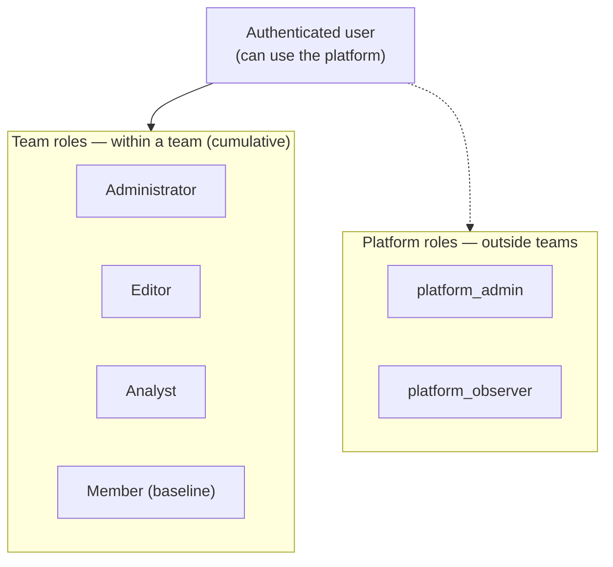

# Roles & permissions

Your permissions depend on your **roles**. There are two independent levels:

- **team roles** — what you can do **within a team**;
- **platform roles** — **cross-cutting** responsibilities, outside any team.

Any authenticated user can **use the platform**: there is no "global" role
gating basic access. Roles only open up extra permissions. Every permission is
checked **server-side** on each action (see
[Security & authorization](/help/en/architecture/security)).

## Team roles

Within a team, each member holds one or more roles. They are **cumulative**: the
same person can be both Administrator and Editor, each role granted separately.

| Role (UI)         | Relation       | Can                                                                                                                                                           | Cannot (unless another role)                          |
| ----------------- | -------------- | ------------------------------------------------------------------------------------------------------------------------------------------------------------- | ----------------------------------------------------- |
| **Administrator** | `team_admin`   | Manage members and their roles; set the team policy (quotas, allowed model profiles, MCP servers, storage/ingestion limits); read the configuration for audit | Create/edit agents, prompts, or routing policy        |
| **Editor**        | `team_editor`  | Manage agents, shared prompts, the routing policy, and the document corpus                                                                                    | Change the team policy, create teams, or assign roles |
| **Analyst**       | `team_analyst` | Create and run evaluation campaigns, manage evaluation corpora                                                                                                | Manage the general corpus, governance, or membership  |
| **Member**        | `team_member`  | Use the team's agents and prompts, manage their own personal prompts, leave the team                                                                          | Change any setting, policy, or shared resource        |

> **Administrator and Editor are orthogonal, not hierarchical.**
> The Administrator governs (members, policy) but has **no** authority over
> agents, prompts, or routing unless they are also an Editor — and vice versa.
> Holding both is two separate grants, not a super-role.

The **Member** role is the implicit baseline: automatic as soon as you hold any
role above, or granted directly. A team always keeps **at least one
Administrator** — the last one can't be removed.

## Platform roles

Outside teams, two roles carry cross-cutting responsibilities. They grant **no
access to any team's data**.

- **`platform_admin`** — governs the **team registry** (which teams exist): list
  all teams, delete one, or "rescue" a team left with no administrator. It also
  seeds the first Administrator when a team is created.
- **`platform_observer`** — accesses **cross-cutting observability**: the
  platform-wide KPIs and analytics (`platform_admin` inherits this).

> **A platform role never substitutes for a team role.** A `platform_admin` who
> holds no role in a given team is **blocked** for any write there: they can
> neither create a library nor touch that team's agents. Any action on a team's
> data requires an explicit team role.

Managing the **infrastructure** (Kubernetes, cloud) is the job of a separate
operations team, outside the application role model.

## How it's enforced

- Each role is a **stored relation** in the authorization engine (`OpenFGA`,
  ReBAC) — never derived from a `Keycloak` role or group, which only handles
  identity (login, JWT).
- Permissions are checked **at the API layer**, not only in the UI: hiding a
  button is never enough to authorize an action.
- Your **personal space** is accessible to you alone: no one, not even a
  `platform_admin`, can reach it.

For the authorization mechanism, see
[Security & authorization](/help/en/architecture/security). To manage members
and their roles, see [Administering your team](/help/en/features/teams).
