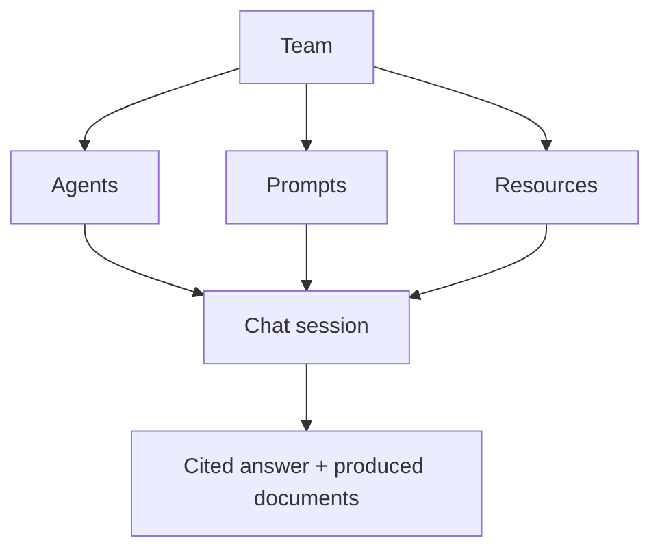

# Key concepts

A handful of words come up everywhere in the platform. Understanding them once
makes everything else simpler.

## Team

A **team** is the basic unit: it gathers people and everything they share —
agents, prompts, and document resources. Every piece of content belongs to a
team and is visible only to its members. Your
[personal space](/help/en/getting-started/first-steps) is a special team, with
you as its only member.

Within a team, each person has a **role** that determines what they can do:
Administrator, Editor, Analyst, or Member (see
[Join or create a team](/help/en/getting-started/join-create-team)).

## Agent

An **agent** is an AI assistant ready to chat. Your team creates it from a
**model** provided by the platform (for example an agent able to search through
documents), then personalizes it: its **system prompt**, the prompts attached to
it, its resources, and its capabilities. These are the agents you talk to in
your conversations.

## Prompt

A **prompt** is a reusable text — a typical question, an instruction, an answer
frame. Prompts are filed into team-owned **categories** that you create and
organize freely. You can insert a prompt into a conversation or attach several
to an agent to shape its behavior.

## Resource

**Resources** are your team's documents. Once uploaded, after a short
preparation moment they become available to agents: this is what lets an
assistant answer based on your content and **show you the passages** it used.

## Chat session

A **session** (or conversation) is an exchange with an agent. It keeps the
message history, attachments, and produced documents. You can resume a session
later or start a new one at any time.

## Capability

A **capability** is an extra function an agent can call on — for example
drafting a document, filling a PowerPoint template, or querying tabular data.
Capabilities are enabled per team.

## How it all fits together

The team gathers agents, prompts, and resources; the conversation puts them to
work together to produce an answer grounded in your content.

Next: [join or create a team](/help/en/getting-started/join-create-team).
