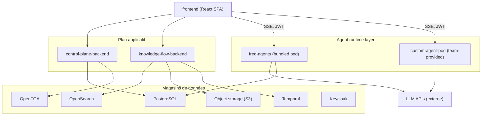
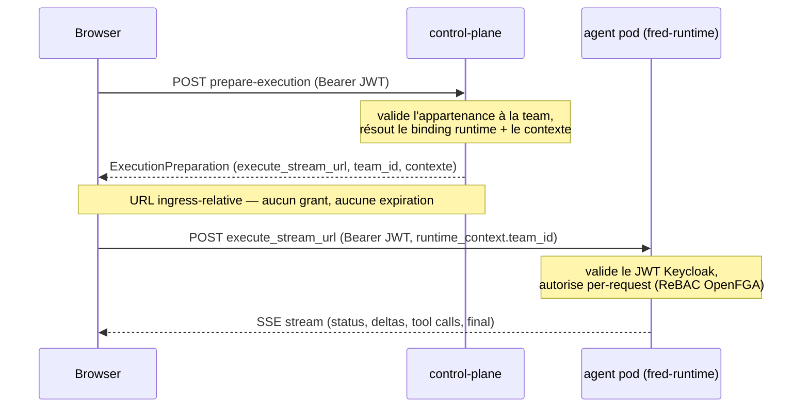

# Architecture technique

Cette section décrit l'**architecture logique** de la plateforme : les
composants, leurs responsabilités, la façon dont ils communiquent, et le modèle
de sécurité qui les relie.

> **Public visé.** Contrairement au reste de ce centre d'aide, cette section
> s'adresse à des profils techniques — ingénieurs IT, architectes, data
> scientists, développeurs. Le vocabulaire y est précis et les composants sont
> désignés par leur nom d'origine (`control-plane`, `knowledge-flow`,
> `fred-agents`, `OpenFGA`, `Keycloak`…).

## Vue logique

La plateforme se décompose en quatre plans, du poste client jusqu'aux magasins
de données :

- Le **frontend** parle au `control-plane` et au `knowledge-flow` pour tout ce
  qui est catalogue, sessions et documents ; il ouvre en revanche le flux
  d'exécution **directement** sur le pod agent (jamais relayé par le
  `control-plane`).
- Le détail de chaque composant est en
  [Les composants](/help/fr/architecture/components).

## Le flux d'une requête

L'exécution d'un tour d'agent suit le **managed path** (le seul autorisé pour le
frontend en production). Trois participants : le navigateur, le
`control-plane-backend`, et un pod `fred-runtime`.

Point clé : le `control-plane` résout **où** l'agent s'exécute (via
`prepare-execution`) mais **n'émet aucune capacité** et ne relaie jamais le flux
SSE. Le navigateur appelle le pod directement avec le **JWT Keycloak de
l'utilisateur** ; le pod authentifie ce token et **autorise lui-même** chaque
requête. Le détail du modèle est en
[Sécurité & autorisation](/help/fr/architecture/security).

## Pourquoi cette forme

Trois principes structurent ce découpage :

- **Découplage.** Le chemin de conversation reste réactif pendant que
  l'ingestion, l'évaluation et les traitements de fond s'exécutent durablement
  via `Temporal`.
- **Governance policy-first.** Les décisions (modèle, tool/MCP, prompt, agent,
  périmètre de données) sont résolues à partir de **policies**, pas codées en
  dur.
- **Extensibilité.** Les agents sont construits et déployés dans leurs propres
  dépôts ; le `control-plane` les découvre et route vers eux, sans dépendance au
  monorepo. Un `custom-agent-pod` est, du point de vue de l'utilisateur,
  indiscernable des pods fournis.
