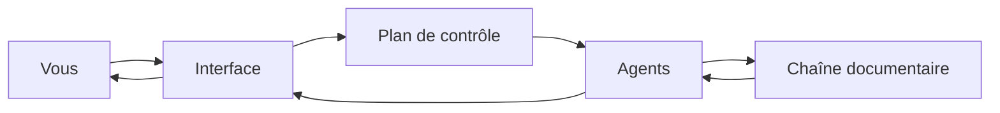

# Architecture technique

Cette section explique, sans jargon inutile, comment la plateforme est
construite. Elle s'adresse à un lecteur curieux du fonctionnement ; elle n'est
pas indispensable pour un usage quotidien.

## Les grands blocs

La plateforme s'organise en quelques composants complémentaires :

- **L'interface** : ce que vous voyez dans le navigateur.
- **Le plan de contrôle** : gère les équipes, les sessions, les prompts, les
  droits — tout ce qui relève de l'organisation et de l'accès.
- **Les agents** : exécutent les conversations, mobilisent les capacités et
  appellent les modèles de langage.
- **La chaîne documentaire** : prépare vos documents après leur dépôt et permet
  aux agents d'y retrouver les passages utiles.

## Le chemin d'une question

Vous posez une question dans l'interface ; le plan de contrôle vérifie vos
droits et achemine la demande ; l'agent construit la réponse, en interrogeant au
besoin la chaîne documentaire pour retrouver et citer vos sources ; la réponse
vous revient dans l'interface.

## Pour aller plus loin

- [Sécurité et permissions](/help/fr/architecture/security)
- [Où vivent les données](/help/fr/architecture/data-storage)
