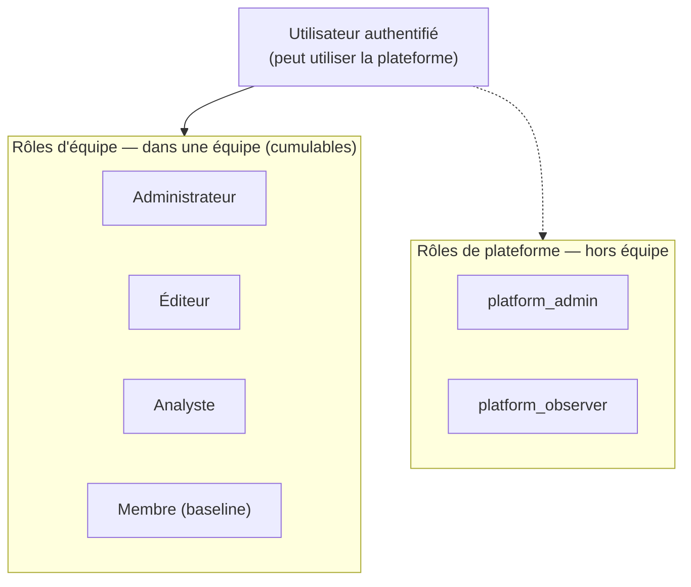

# Rôles et droits

Vos droits dépendent de vos **rôles**. Il en existe deux niveaux, indépendants
l'un de l'autre :

- les **rôles d'équipe** — ce que vous pouvez faire **au sein d'une équipe** ;
- les **rôles de plateforme** — des responsabilités **transverses**, en dehors
  de toute équipe.

Tout utilisateur authentifié peut **utiliser la plateforme** : il n'y a pas de
rôle « global » qui conditionne l'accès de base. Les rôles ne font qu'ouvrir des
droits supplémentaires. Chaque droit est vérifié **côté serveur** à chaque
action (voir [Sécurité & autorisation](/help/fr/architecture/security)).

## Les rôles d'équipe

Au sein d'une équipe, chaque membre porte un ou plusieurs rôles. Ils sont
**cumulables** : une même personne peut être à la fois Administrateur et Éditeur,
chaque rôle étant accordé séparément.

| Rôle (UI)          | Relation       | Peut                                                                                                                                                                                         | Ne peut pas (sauf autre rôle)                                            |
| ------------------ | -------------- | -------------------------------------------------------------------------------------------------------------------------------------------------------------------------------------------- | ------------------------------------------------------------------------ |
| **Administrateur** | `team_admin`   | Gérer les membres et leurs rôles ; définir la politique d'équipe (quotas, profils de modèles autorisés, serveurs MCP, limites de stockage/ingestion) ; consulter la configuration pour audit | Créer/modifier agents, prompts ou politique de routage                   |
| **Éditeur**        | `team_editor`  | Gérer les agents, les prompts partagés, la politique de routage et le corpus documentaire                                                                                                    | Modifier la politique d'équipe, créer des équipes ou attribuer des rôles |
| **Analyste**       | `team_analyst` | Créer et lancer des campagnes d'évaluation, gérer les corpus d'évaluation                                                                                                                    | Gérer le corpus général, la gouvernance ou les membres                   |
| **Membre**         | `team_member`  | Utiliser les agents et prompts de l'équipe, gérer ses prompts personnels, quitter l'équipe                                                                                                   | Modifier un réglage, une politique ou une ressource partagée             |

> **Administrateur et Éditeur sont orthogonaux, pas hiérarchiques.**
> L'Administrateur gouverne (membres, politique) mais n'a **aucun** droit sur les
> agents, prompts ou le routage tant qu'il n'est pas aussi Éditeur — et
> inversement. Cumuler les deux, c'est deux droits distincts, pas un super-rôle.

Le rôle **Membre** est la base implicite : automatique dès qu'on porte un rôle
au-dessus, ou attribué directement. Une équipe garde toujours **au moins un
Administrateur** — impossible de retirer le dernier.

## Les rôles de plateforme

En dehors des équipes, deux rôles portent des responsabilités transverses. Ils
**ne donnent aucun accès aux données** d'une équipe.

- **`platform_admin`** — gouverne le **registre des équipes** (lesquelles
  existent) : lister toutes les équipes, en supprimer une, ou « secourir » une
  équipe restée sans administrateur. C'est aussi lui qui amorce la première
  attribution d'Administrateur à la création d'une équipe.
- **`platform_observer`** — accède à l'**observabilité transverse** : les KPI et
  analytics à l'échelle de la plateforme (`platform_admin` en hérite).

> **Un rôle de plateforme ne remplace jamais un rôle d'équipe.** Un
> `platform_admin` qui ne détient aucun rôle dans une équipe donnée y est
> **bloqué** pour toute écriture : il ne peut ni créer une bibliothèque, ni
> toucher aux agents de cette équipe. Toute action sur les données d'une équipe
> exige un rôle d'équipe explicite.

La gestion de l'**infrastructure** (Kubernetes, cloud) relève d'une équipe
d'exploitation distincte, en dehors du modèle de rôles applicatif.

## Comment c'est appliqué

- Chaque rôle est une **relation stockée** dans le moteur d'autorisation
  (`OpenFGA`, ReBAC) — jamais dérivée d'un rôle ou groupe `Keycloak`, qui ne
  gère que l'identité (connexion, JWT).
- Les droits sont vérifiés **au niveau de l'API**, pas seulement dans
  l'interface : masquer un bouton ne suffit jamais à autoriser une action.
- Votre **espace personnel** n'est accessible qu'à vous : personne, pas même un
  `platform_admin`, ne peut y accéder.

Pour le détail du mécanisme d'autorisation, voir
[Sécurité & autorisation](/help/fr/architecture/security). Pour gérer les
membres et leurs rôles, voir [Administrer son équipe](/help/fr/features/teams).
