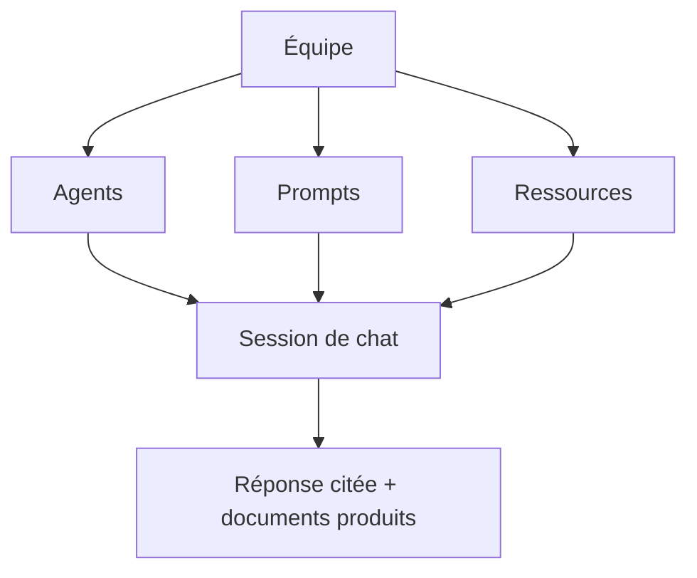

# Les concepts clés

Quelques mots reviennent partout dans la plateforme. Les comprendre une bonne
fois rend tout le reste plus simple.

## Équipe

Une **équipe** est l'unité de base : elle rassemble des personnes et tout ce
qu'elles partagent — agents, prompts et ressources documentaires. Chaque
contenu appartient à une équipe et n'est visible que par ses membres. Votre
[espace personnel](/help/fr/getting-started/first-steps) est une équipe
particulière, dont vous êtes le seul membre.

Au sein d'une équipe, chacun a un **rôle** qui détermine ce qu'il peut faire :
Administrateur, Éditeur, Analyste ou Membre (voir
[Rejoindre ou créer une équipe](/help/fr/getting-started/join-create-team)).

## Agent

Un **agent** est un assistant IA prêt à dialoguer. Il se décline en deux temps :

- Un **template** est un modèle d'agent fourni par la plateforme (par exemple
  un agent capable de fouiller des documents).
- Une **instance** est l'agent concret que votre équipe crée à partir d'un
  template et configure à sa main : son prompt d'engagement, les prompts qui
  lui sont attachés, ses ressources et ses capacités.

Quand vous discutez, vous parlez toujours à une **instance** d'agent.

## Prompt

Un **prompt** est un texte réutilisable — une question type, une consigne, un
cadre de réponse. Les prompts sont rangés dans des **catégories** propres à
l'équipe, que vous créez et organisez librement. Vous pouvez insérer un prompt
dans une conversation ou en attacher plusieurs à un agent pour orienter son
comportement.

## Ressource

Les **ressources** sont les documents de votre équipe. Une fois déposés, ils
sont **ingérés** (analysés et indexés) pour devenir interrogeables par les
agents : c'est ce qui permet à un assistant de répondre en s'appuyant sur vos
contenus et de **citer ses sources**.

## Session de chat

Une **session** (ou conversation) est un échange avec un agent. Elle conserve
l'historique des messages, les pièces jointes et les documents produits. Vous
pouvez reprendre une session plus tard ou en démarrer une nouvelle à tout
moment.

## Capacité

Une **capacité** est une fonction supplémentaire qu'un agent peut mobiliser —
par exemple rédiger un document, remplir un modèle PowerPoint ou interroger des
données tabulaires. Les capacités s'activent par équipe.

## Comment tout s'articule

L'équipe réunit agents, prompts et ressources ; la conversation les fait
travailler ensemble pour produire une réponse appuyée sur vos contenus.

La suite : [rejoindre ou créer une équipe](/help/fr/getting-started/join-create-team).
