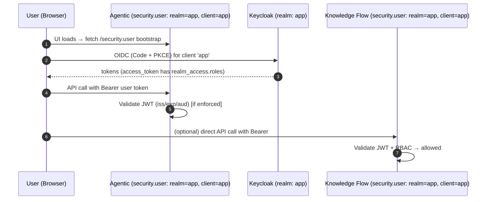
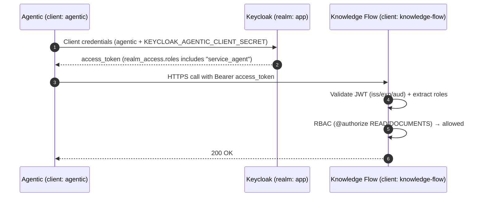

# Keycloak Integration — Users & Services
(Fred: Agentic ↔ Knowledge Flow)

This guide shows how to wire **user login** (UI ↔ backends) and **service-to-service** calls (**Agentic → Knowledge Flow**) using Keycloak. It is **linear**, and each section is complete on its own.

> Enforcement today
> - Signature / expiry / issuer: **enforced** in backends  
> - Roles (RBAC): **enforced in Knowledge Flow** (`@authorize(...)` + `RBACProvider`)  
> - Audience (`aud`): supported; recommended strict in production

---

## 1) Keycloak Configuration

This MUST be performed for each application environment. 

### 1.1 Realm
- Create realm, e.g. **`app`** (matches your config: `.../realms/app`).

### 1.2 Clients
Create **three** clients:

| Client ID         | Type           | Service Account | Used by | Purpose |
|---                |---             |---              |---      |---|
| `app`             | Public (SPA+PKCE) or Confidential | **OFF** | **UI** | End-user login. UI reads bootstrap from Agentic’s `security.user`. |
| `agentic`         | **Confidential** | **ON** | **Agentic backend** | Mints **service tokens** to call Knowledge Flow. **Needs a client secret.** |
| `knowledge-flow`  | **Confidential** | ON | **KF backend** | KF’s identity; can mint tokens when KF calls other services. **Needs a client secret** if used for outbound calls.

> Generate and note **two secrets**:
> - `agentic` → **KEYCLOAK_AGENTIC_CLIENT_SECRET**
> - `knowledge-flow` → **KEYCLOAK_KNOWLEDGE_FLOW_CLIENT_SECRET** (only needed if KF calls others)

### 1.3 Roles (used by KF RBAC)
Create **client roles** for `app` client (not realm roles):

| Role       | Assigned To                 | Grants in KF (`RBACProvider`) |
|---               |---                          |---|
| `admin`          | Admin users                 | All actions on all resources |
| `editor`         | Power users / curators      | CRUD on most KF resources + limited Agentic actions |
| `viewer`         | Standard users              | READ on most resources; can chat, upload attachments |
| `service_agent`  | **Agentic service account** | `READ` on `TAGS`, `DOCUMENTS` (vector search) |

### 1.4 (Optional but recommended) Groups
- Create groups `admins`, `editors`, `viewers` and map roles 1:1.
- Assign users to groups.

### 1.5 Assign `service_agent` to Agentic’s **service account**
- **Clients → agentic → Service account roles → Assign** → `service_agent`.

### 1.6 Attach built-in `roles` client scope
- **Clients → app → Client scopes → Default client scopes** must include `roles`.
- **Clients → agentic → Client scopes → Default client scopes** must include `roles`.
  - Without this, tokens won’t carry `realm_access.roles`.

> (Later, for strict audience) add an **Audience** mapper so tokens that hit KF include `knowledge-flow` in `aud`.

---

## 2) Configure the two backends

Both backends use the **same pattern**: a YAML block with `security.m2m` and `security.user`.
- `security.user`: lets the **UI** log users in against the **realm `app`** with **client `app`** (both Agentic and KF can validate user tokens).
- `security.m2m`: identifies the **service identity** of that backend (Agentic uses `agentic`, KF uses `knowledge-flow`).

### 2.1 Agentic `configuration.yaml`
```yaml
app:
  name: "Agentic Backend"
  base_url: "/agentic/v1"
  address: "127.0.0.1"
  port: 8000
  log_level: "info"
  reload: false
  reload_dir: "."

security:
  # Machine-to-machine (Agentic => Knowledge Flow)
  m2m:
    enabled: true
    client_id: "agentic"                          # Keycloak client for Agentic's service account
    realm_url: "http://app-keycloak:8080/realms/app"

  # User OIDC bootstrap (read by the UI at startup)
  user:
    enabled: true
    client_id: "app"                              # Frontend client
    realm_url: "http://app-keycloak:8080/realms/app"

  authorized_origins:
    - "http://localhost:5173"                   # CORS for dev UI
```

#### Required environment variable (secret)
```
KEYCLOAK_AGENTIC_CLIENT_SECRET=<secret of client 'agentic'>
```

> Why: Agentic uses **client_credentials** with `agentic` + secret to mint service tokens for calls to KF.

---

### 2.2 Knowledge Flow `configuration.yaml`
```yaml
app:
  name: "Knowledge Flow Backend"
  base_url: "/knowledge-flow/v1"
  address: "127.0.0.1"
  port: 8111
  log_level: "info"
  reload: false
  reload_dir: "."

security:
  # Machine-to-machine identity (used if KF calls other services)
  m2m:
    enabled: true
    client_id: "knowledge-flow"                   # KF's own service identity
    realm_url: "http://app-keycloak:8080/realms/app"

  # User OIDC bootstrap (same realm/client as the UI)
  user:
    enabled: true
    client_id: "app"
    realm_url: "http://app-keycloak:8080/realms/app"
  
  authorized_origins:
    - "http://localhost:5173"
```

#### Required environment variable (secret, only if KF calls others)
```
KEYCLOAK_KNOWLEDGE_FLOW_CLIENT_SECRET=<secret of client 'knowledge-flow'>
```

#### Recommended hardening flags (if using envs)
```
FRED_STRICT_ISSUER=true
FRED_STRICT_AUDIENCE=true   # turn on after adding Audience mapper
FRED_JWT_CLOCK_SKEW=0
FRED_AUTH_VERBOSE=false
```

> Why: KF must **validate incoming tokens** (from UI users and from Agentic). RBAC is enforced via `@authorize(...)` and your `RBACProvider`.

---

## 3) What the UI does 
- At startup, the **UI fetches Agentic’s `security.user`** (realm URL, client_id, allowed origins).
- The UI logs the user into **realm `app`**, **client `app`** (Authorization Code + PKCE).
- The UI calls Agentic and/or KF with the **user’s Bearer token**.
- Both backends can validate that user token (they share realm and client scope setup).

---

## 4) Verify your setup

### 4.1 Get a **service** token for Agentic
```bash
KC="http://app-keycloak:8080/realms/app/protocol/openid-connect/token"
TOKEN=$(curl -s -X POST "$KC" \
  -d grant_type=client_credentials \
  -d client_id=agentic \
  -d client_secret="$KEYCLOAK_AGENTIC_CLIENT_SECRET" | jq -r .access_token)

# Check roles in the token
cut -d. -f2 <<<"$TOKEN" | base64 -d | jq .realm_access
# Expect: { "roles": ["service_agent", ...] }
```

### 4.2 Call a protected KF endpoint (e.g., MCP base over HTTP)
```bash
BASE="http://<kf-host-or-ingress>/knowledge-flow/v1/mcp-opensearch-ops/"
curl -v \
  -H "Authorization: Bearer $TOKEN" \
  -H "MCP-Version: 2025-03-26" \
  -H "Accept: application/json" \
  "$BASE"
# Expect: 200 OK; KF logs show roles incl. 'service_agent'
```

---

## 5) RBAC 

The `RBACProvider` maps roles to resources:

```python
"admin":  { resource: ALL for resource in Resource },
"editor": { ... CRUD on KF resources ... },
"viewer": { READ-only defaults + chat/attachments/prompts },
"service_agent": {
    Resource.TAGS: READ_ONLY,
    Resource.DOCUMENTS: READ_ONLY,
}
```
Note that this provided is used in both the agentic and knowledge flow backend. It is defined in the fred-core library. 


Endpoints declare requirements, e.g.:
```python
@authorize(Action.READ, Resource.DOCUMENTS)
def similarity_search_with_score(..., user: KeycloakUser, ...):
    ...
```

If role missing:
```
Authorization denied: user=<uid> roles=<[]> action=read resource=documents
```

---

## 6) (Optiona) Audience strictness
- Turn on in KF with `FRED_STRICT_AUDIENCE=true`.
- Add **Audience mapper** so tokens include `knowledge-flow` in `aud`:
  - For **service tokens** from `agentic` → include `knowledge-flow`.
  - For **user tokens** (client `app`) → include each API audience you call.

---

## 7) Troubleshooting

- **`roles=[]` on service token** → you created a realm role instead of client role, or `roles` scope missing on `agentic`.
- **User token has no roles** → user not in group/role, or `roles` scope missing on `app`.
- **307 → 401** on MCP base → wrong trailing slash or ingress redirect; base **must end with `/`**.
- **`aud` denied** (strict mode) → add Audience mapper for `knowledge-flow`.
- **CORS errors** → add the UI origin under `security.authorized_origins` (Agentic and KF).
- **KF calling others fails** → set `KEYCLOAK_KNOWLEDGE_FLOW_CLIENT_SECRET` and use `security.m2m` from KF.

---

## 8) Diagrams (reference)

### 8.1 User login & API calls


### 8.2 Service-to-service (Agentic → KF)

