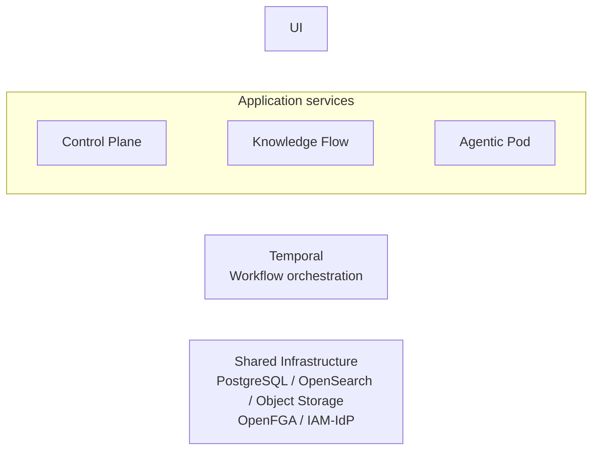

# 1. System overview

```mermaid
flowchart TB
    ui["UI"]

    subgraph services["Application services"]
        direction LR
        cp["Control Plane"]
        kf["Knowledge Flow"]
        ap["Agentic Pod"]
        cp ~~~ kf ~~~ ap
    end

    temporal["Temporal<br/>Workflow orchestration"]
    infra["Shared Infrastructure<br/>PostgreSQL / OpenSearch / Object Storage<br/>OpenFGA / IAM-IdP"]

    ui ~~~ services
    services ~~~ temporal
    temporal ~~~ infra
```
