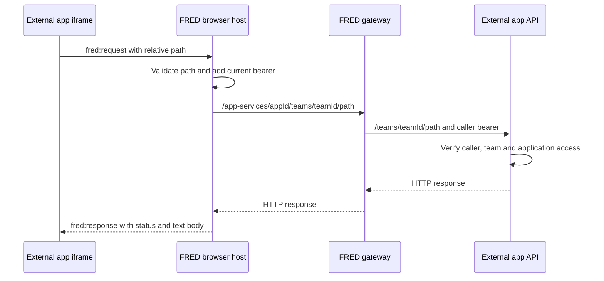

# RFC: Versioned frontend packages for external application integration with FRED

**Status:** Partially implemented — design-token, initial UI, protocol-`"1"` iframe SDK archive foundations, and coordinate-independent release-readiness tooling are implemented; registry decisions, publication, FRED registry adoption, theme/live-locale extensions, catalog expansion, and external adoption remain open
**Date:** 2026-09-07  
**Area:** FRED frontend, design system, application integration, package delivery  
**Scope:** Common frontend integration contract for independently deployed external applications  
**First adopter:** RAGS, an external application; pilot details in §10.2  
**Repository location:** `docs/swift/FRED-FRONTEND-PACKAGING-RFC.md`
**Source baseline:** `ThalesGroup/fred`, branch `swift`, commit [`3bee57eb90a3b9883fd4224cee6ea3a7d3f73c55`](https://github.com/ThalesGroup/fred/commit/3bee57eb90a3b9883fd4224cee6ea3a7d3f73c55). The supplied `fred-swift(4).zip` archive identifies this commit, which matched the GitHub branch when checked on 2026-09-07.

Package names, new exports, and release numbers below are **proposals**, not packages verified to exist on npm. `@fred` is a working scope name; maintainers must confirm an organization-controlled scope before publication.

## 1. Decision proposed

Develop and maintain shared frontend code in FRED, publish it as versioned packages to a public npm-compatible registry, and let independently deployed applications install those packages during their own builds.

Start with three bounded packages:

| Proposed package      | Responsibility                                                                               | Consumer requirements                            |
| --------------------- | -------------------------------------------------------------------------------------------- | ------------------------------------------------ |
| `@fred/design-tokens` | Existing visual tokens, theme selectors, and optional typography assets                      | CSS; no React dependency                         |
| `@fred/ui`            | A small, reviewed set of existing presentation components and all their runtime assets       | Supported React and React DOM versions           |
| `@fred/iframe-sdk`    | Framework-independent client and shared wire definitions for FRED's existing iframe protocol | Browser; no React, Redux, or Keycloak dependency |

FRED must consume the extracted implementations itself. External applications consume published versions without copying FRED files or requiring a sibling FRED checkout.

**This is an application-agnostic platform contract.** Each external application retains its own repository, business logic, backend, deployment, and release cycle. Shared packages expose presentation primitives and host integration capabilities; application identifiers, service routes, and domain models belong to consumer configuration or consumer code. The first adopter uses the same contract as subsequent applications.

**The iframe remains the application integration boundary.** Installing a UI package gives an application its own copy of shared presentation code at build time. It does not load external application code into FRED's bundle, share React instances between documents, or synchronize deployed versions automatically.

The first release wraps the existing protocol `"1"`. A small, separately reviewed context extension adds theme synchronization; it does not introduce another messaging system.

## 2. Problem and motivation

External applications need the FRED appearance and interaction conventions while retaining their own repository, build, server, and release cycle. Manually copying components, CSS, fonts, or iframe helpers creates undocumented dependencies and makes fixes diverge between applications.

The backend packaging experience establishes the useful principle: an external consumer should receive a complete artifact from a registry. On the frontend, the equivalent artifact is an npm package containing compiled JavaScript, type declarations, CSS, and referenced assets. A component package that works only because the consumer copied FRED's fonts or public directory has not solved the packaging problem.

An iframe has its own document and stylesheet environment. Installing the same design system in the child is how it acquires FRED's appearance. FRED's host styles do not cascade into it, including when both documents use the same origin.

Versioning makes differences visible and upgrades controlled. It does not guarantee that independently released applications always look identical: owners still need an explicit upgrade process and compatibility tests.

## 3. What already exists in `swift`

The following are source observations, not proposed features.

| Existing element                         | Evidence and implication                                                                                                                                                                                                                                                                                                                                                 |
| ---------------------------------------- | ------------------------------------------------------------------------------------------------------------------------------------------------------------------------------------------------------------------------------------------------------------------------------------------------------------------------------------------------------------------------ |
| One private frontend application         | [`apps/frontend/package.json`][source-package] declares `fred-ui`, version `1.5.2`, `private: true`, React/React DOM `^19.2.4`, TypeScript `^5.9.3`, and Vite `^6.4.2`. These are manifest declarations, not a proposed library version.                                                                                                                                 |
| A native design system                   | Tokens are in [`src/styles/`][source-styles]; components are in [`src/rework/components/shared/`][source-shared]. Extract these implementations; do not introduce MUI or redesign the system.                                                                                                                                                                            |
| Global styles mixed with reusable assets | [`src/styles/index.css`][source-styles-index] combines tokens, font faces, semantic color helpers, and shell-wide rules such as `html` overflow and text selection. It cannot be published wholesale as a neutral stylesheet.                                                                                                                                            |
| Asset paths tied to the application      | [`Icon.tsx`][source-icon] resolves custom icons under `/images/icons/`; font declarations reference `src/assets/fonts`. Published components must resolve their own assets.                                                                                                                                                                                              |
| Existing iframe protocol                 | [`applicationProtocol.ts`][source-protocol-contract] is the canonical transport-neutral source for protocol `"1"`, context, navigation, request/response, and open-chat messages; [`applicationHost.ts`][source-host-contract] retains host-only policy and compatibility re-exports. There is no theme field, resize message, or notification message in that contract. |
| Existing authenticated request broker    | [`applicationRequest.ts`][source-request] keeps Keycloak integration in the host and builds team-scoped service requests. It is not suitable for publication as a child-side API client.                                                                                                                                                                                 |
| Existing runtime application host        | [`TeamApplicationHostPage.tsx`][source-host-page] validates both message origin and source window, uses a 15-second handshake timeout, and limits concurrent proxied requests to 16.                                                                                                                                                                                     |
| Existing generic gateway configuration   | [`config/.env.template`][source-env], [`application-proxy.mjs`][source-proxy], and [`docker-entrypoint.sh`][source-entrypoint] already support multiple applications using `FRONTEND_APPLICATIONS_JSON`. No per-application Makefile target is required.                                                                                                                 |

The authority for the shipped application integration is [the control-plane product contract, §46][source-product-contract], checked against the code. The [application-hosting RFC][source-hosting-rfc] still contains draft and deferred material; it must not be interpreted as evidence that hosting remains entirely unimplemented.

That earlier RFC explicitly excluded a shared component library from its scope. This RFC proposes that missing, separately versioned layer while preserving hosting and authorization. Registration lifecycle, tombstones, personal-space applications, and application health remain outside this proposal.

## 4. Goals and limits

### Goals

- Build an external application from its repository, committed lockfile, and registry dependencies alone.
- Reuse the current visual system, with complete CSS, fonts, and icons.
- Give React applications reusable components and other frameworks a tokens-only option.
- Replace repeated raw iframe messaging with one tested SDK compatible with the current host.
- Keep FRED authentication, team selection, navigation authority, and backend authorization in their current owners.
- Support a separately hosted UI through an absolute configured URL, as well as the existing gateway path.
- Prove the boundary with FRED, a neutral external application fixture, and one real first-adopter screen before expanding the component catalog.
- Let additional applications integrate through documented registration, configuration, and package dependencies without application-specific changes to FRED's host or shared packages.

### Application independence

- Shared package implementations and protocol definitions must not hard-code consumer identities, endpoints, business models, or application-specific branches. Consumer values flow through generic configuration and message fields.
- Each consumer owns its business API adapter, UI screens, configuration, and package upgrade decisions.
- A second application must be able to use a different application ID, UI origin, and service upstream through the existing generic registration mechanism. New platform capabilities still require normal contract review.
- Application independence does not imply universal framework support: `@fred/ui` targets supported React versions, while tokens and the iframe SDK remain framework-independent. Consumers select the packages they need.

### Outside this RFC

Runtime module federation; a new application registry; a new permission model; publishing all of `apps/frontend`; packaging external application business screens into FRED; a shared Redux store; parent-document CSS injection; new streaming or binary transports; and standalone sign-in for external applications.

“Runs on another server” describes deployment. It does not imply that an authenticated embedded application must also function outside FRED without a host. Standalone authentication, if needed, requires a separate design.

## 5. Package boundaries and repository ownership

### 5.1 Producer layout

Use a small private npm workspace under `libs/frontend/`, consistent with FRED maintaining reusable code under `libs/`:

| Proposed path                                        | Contents                                                                        |
| ---------------------------------------------------- | ------------------------------------------------------------------------------- |
| `libs/frontend/package.json` and `package-lock.json` | Private workspace root, shared build/test scripts, pinned development toolchain |
| `libs/frontend/design-tokens/`                       | Publishable token package                                                       |
| `libs/frontend/ui/`                                  | Publishable React component package                                             |
| `libs/frontend/iframe-sdk/`                          | Publishable framework-independent SDK                                           |
| `libs/frontend/fixtures/`                            | Private integration fixtures; never published                                   |

Keep `apps/frontend` as a normal package consumer with its existing independent lockfile. This avoids making the entire FRED application part of a new repository-wide JavaScript workspace solely to release three libraries. npm workspaces provide local linking for development within the producer workspace. ([npm workspaces documentation](https://docs.npmjs.com/cli/v11/using-npm/workspaces/))

For production, FRED and each external application declare registry versions. For prepublication validation, install built tarballs into disposable consumer projects, including a temporary copy of the FRED frontend when testing host changes. Local links and tarball paths must not enter committed consumer release manifests or lockfiles.

### 5.2 Allowed dependencies

| Package       | Allowed                                                              | Excluded                                                                                           |
| ------------- | -------------------------------------------------------------------- | -------------------------------------------------------------------------------------------------- |
| Design tokens | CSS and distributable typography assets                              | React, application state, network access                                                           |
| UI            | React peers; token peer; extracted presentation utilities and assets | Redux, Keycloak, FRED routers, backend clients, application contexts, team/session business models |
| Iframe SDK    | Browser primitives, shared protocol types and validation             | React, UI components, Keycloak, host store, FRED backend clients                                   |

The host keeps catalog resolution, authorization-related hooks, `applicationFrameTarget`, routing decisions, and `createApplicationRequest`. The implemented archive generator copies only the transport-neutral canonical `applicationProtocol.ts` source into disposable build input for the SDK's `./protocol` export. The generated `ApplicationSummary` type remains host-side and does not leak into the public package.

Temporary application re-exports preserve FRED imports without making FRED consume an unpublished workspace package. They point to the canonical application protocol module; maintaining copied protocol implementations is prohibited. Registry consumption and removal of compatibility re-exports remain later migration work.

## 6. Design tokens and UI contract

### 6.1 Tokens and CSS

Preserve existing variable names and values for the first extraction, including `--primary`, `--on-surface`, `--font-family-base`, and the existing spacing and radius scales. Preserve the light/dark `[data-theme]` selectors. Renaming everything to a new prefix would unnecessarily combine packaging with a visual migration.

Proposed explicit imports:

```ts
import "@fred/design-tokens/tokens.css";
import "@fred/design-tokens/fonts.css";
import "@fred/ui/styles.css";
```

- `tokens.css` contains visual variables and theme definitions; it has no shell layout rules or remote font fetches.
- `fonts.css` is optional and carries package-relative Geist font assets with their applicable notices. Tokens-only consumers can provide their own font policy.
- `styles.css` contains compiled component styles, required semantic color helper selectors, icon font declarations/assets, and reusable styling support.
- Shell-specific scrolling, application sizing, global selection restrictions, and decorative page-wide rules remain in FRED's shell stylesheet.
- Any shared base rules must be documented and narrowly scoped to a consumer-owned `.fred-ui` root; import has no hidden theme or document mutation.

The consumer sets `data-theme` on its own document root and opts into `.fred-ui` on its application root. Portal-based components must render inside that themed root, or accept a caller-supplied portal container there. They must not assume a FRED-only DOM node or read the parent's document.

Compiled CSS modules remain the component implementation technique. Their generated class names are private; consumers use exported props, supported CSS variables, and `className`, not selectors copied from generated markup.

### 6.2 Initial component surface

Start from these existing components, subject to dependency and accessibility checks:

| First extraction                              | Required treatment                                                                                                                                                                            |
| --------------------------------------------- | --------------------------------------------------------------------------------------------------------------------------------------------------------------------------------------------- |
| `Button`, `IconButton`, `Icon`                | Include visual types, icon styling and assets; resolve custom SVGs through package-owned imports or an explicit consumer asset adapter. Never require `/images/icons` on the consumer server. |
| `TextInput`, `TextArea`, `Checkbox`, `Switch` | Preserve labels, disabled/error behavior, keyboard behavior, and current public props where practical.                                                                                        |
| `Chip`, `Spinner`                             | Carry all token/style dependencies and accessible status semantics.                                                                                                                           |
| `PageEmptyState`                              | Keep message text and actions supplied by the consumer; no FRED translation catalog dependency.                                                                                               |

Add `Tooltip`, menus, selects, and modal molecules only after their extracted utilities, focus behavior, and portal ownership pass the external fixture. Do not publish a component just because it sits in an `atoms` or `molecules` folder: several current components encode domain concepts or depend on other infrastructure.

Keep chat, agent, source-document, task-state, and other domain-specific business components in their owning applications. Do not add a generic `Card`, `Modal`, or `FredProvider` merely to resemble another design system.

All transitive assets must ship inside the tarball or be declared dependencies. Build output must contain no unresolved FRED aliases such as `@shared`, `@rework`, or repository-relative asset paths. Font/icon notices must be retained according to the specific upstream asset licenses; the code repository's license alone is not an asset inventory.

### 6.3 React compatibility

Start with React and React DOM peer ranges `^19.2.4`, matching the inspected FRED baseline. Broaden support only after testing the proposed lower versions. The UI package must externalize `react`, `react-dom`, their subpaths, and JSX runtimes during bundling; declaring peers alone does not prevent accidental bundling.

Each application supplies its own React runtime. The FRED parent and an external application iframe can have separate React installations because they are separate documents; the duplicate-runtime risk concerns incompatible React copies within one application. ([React documentation](https://react.dev/warnings/invalid-hook-call-warning))

Use a peer dependency on `@fred/design-tokens` to express a tested compatible range. Consumers install the token package explicitly, preventing an unnoticed second token version. The SDK has no dependency on either UI package.

## 7. Iframe SDK contract

### 7.1 Preserve protocol `"1"`

The initial SDK must implement the existing message names and serialized shapes:

| Direction    | Existing message                       | SDK responsibility                                                                                |
| ------------ | -------------------------------------- | ------------------------------------------------------------------------------------------------- |
| Child → host | `fred:ready`                           | Announce supported protocol after installing the receive listener                                 |
| Host → child | `fred:context`                         | Validate and expose application identity, team, route, and locale                                 |
| Host → child | `fred:route`                           | Notify the application's own router without navigation loops                                      |
| Child → host | `fred:navigate`                        | Request a relative route inside the application's subtree                                         |
| Child → host | `fred:open-chat`                       | Pass an optional session candidate; the host decides the destination                              |
| Child → host | `fred:request`                         | Send a unique request ID, relative path, allowed method, ordinary headers, and string/null body   |
| Host → child | `fred:response`, `fred:response-error` | Correlate replies, settle pending requests, and distinguish HTTP responses from transport failure |

These shapes come from the existing implementation, not a new API family. The bounded archive foundation now exposes this public child API:

```ts
import { createFredApplicationClient } from "@fred/iframe-sdk";

const client = createFredApplicationClient({
  hostOrigin: "https://fred.example.com", // deployment-owned public configuration
  applicationId: "example-app", // must match the registered application identity
});

const context = await client.connect();
const stopRoutes = client.onRoute((subPath) => {
  // Update the application's own router.
});

const response = await client.request("records", { method: "GET" });
const records = await response.json();

// When the application integration is torn down:
stopRoutes();
client.dispose();
```

`example-app` and `records` are illustrative consumer values, not SDK defaults or reserved identifiers. The public request method may return a reconstructed browser `Response`, with correct handling of bodyless responses, but must explicitly document that it is a buffered text/JSON transport. It is not full Fetch equivalence: binary bodies, multipart uploads, SSE, streaming, and remote cancellation are not implemented by protocol `"1"`.

Required client behavior:

- Validate the exact configured host origin and require `event.source === window.parent`; send only to that exact origin. Also validate the incoming message shape and expected application identity. Browser messaging requires origin/source checks as well as payload validation. ([MDN postMessage documentation](https://developer.mozilla.org/en-US/docs/Web/API/Window/postMessage))
- Install listeners before sending `ready`; use bounded handshake retries and an explicit connection deadline coordinated with the host's existing 15-second timeout. Never turn a missing host into a silent success.
- Do not send operational requests before a valid context arrives. Host-side authorization remains independent of this client-side discipline.
- Generate unique request IDs, correlate out-of-order responses, and bound pending work. Preserve the current host limits, including 16 in-flight requests, 128-character request IDs, and 32 request headers.
- Reject absolute or traversing paths and protected headers locally for usable errors; host validation remains authoritative.
- Define local request deadlines and disposal behavior. A local timeout/abort releases client state but does **not** claim to cancel a server mutation. Do not automatically retry mutations after uncertain transport failure.
- On disposal, remove listeners, reject pending promises, and ignore late replies. Reconnection after frame reload creates a fresh client lifecycle.
- Keep HTTP 401/403/5xx responses distinguishable from `fred:response-error`; the existing wire error has no detailed reason code, so the SDK must not invent one.

The host already aborts its in-flight fetches when the frame is disposed. Extracting the package must preserve that host behavior, its protected-header checks, bounded concurrency, and refresh/401 handling.

### 7.2 Theme and locale synchronization

Current context contains team, route, and locale, but no theme. The host sends locale in its handshake context; live theme and locale synchronization must be implemented explicitly.

Propose one additive field on the existing context:

```ts
theme?: "light" | "dark";
```

The host obtains its resolved theme from existing application context, sends it with `fred:context`, and resends the context when resolved theme or locale changes. The SDK exposes `onContext`; the application sets its own root theme and its own i18n locale. Pass the resolved value, not an instruction to inspect the parent's DOM or storage.

An SDK connected to an older host uses its documented local/system theme fallback when the field is absent. Consumers using the extension must accept repeated context updates without resetting their business state. Preserve the existing team-switch remount behavior so pending work cannot bleed into another team.

Keep protocol `"1"` only after compatibility fixtures prove that the optional field and repeated context delivery do not break existing clients. If a supported client rejects those changes, introduce explicit protocol version `"2"` support on the host first and retain version `"1"`; reply using each frame's accepted version and preserve its version-specific behavior. Do not silently change version `"1"` semantics. Package extraction itself does not require a protocol bump.

### 7.3 Authentication and navigation ownership

Never expose a FRED bearer, Keycloak object, host Redux store, or upstream URL through the SDK. The existing host request adapter owns token refresh and its one 401 retry. An application-service denial must not independently log the user out of FRED.

`navigate` remains confined to the application's route subtree. `openChat` remains the existing constrained intent: a supplied session ID is a candidate the host resolves using the viewer's authorized session listing, not an arbitrary destination.

UI visibility, context fields, and SDK use do not authorize backend access. The application API must validate the caller and team/application entitlement using the existing approved trust tier. Packaging changes neither those tiers nor the ownership of FRED datastores.

## 8. Deployment and network calls

### 8.1 Two supported UI delivery modes

| Deployment              | Browser loads iframe from                                              | Consequences                                                                                                                                                                         |
| ----------------------- | ---------------------------------------------------------------------- | ------------------------------------------------------------------------------------------------------------------------------------------------------------------------------------ |
| Existing gateway mode   | `https://fred.example.com/apps/example-app/`                           | The gateway forwards to the independently deployed external UI server. That server receives the complete `/apps/example-app/` prefix; build assets and SPA fallback must support it. |
| Separate browser origin | An absolute configured URL such as `https://external-app.example.com/` | The browser fetches UI assets from the external application server directly. Host-to-child messages use the two actual origins. The authenticated API broker remains in FRED.        |

A different server behind the FRED gateway is still the same browser origin. An absolute iframe URL can create a genuinely different origin. The current same-origin frame is a rendering/lifecycle boundary for trusted applications, not security isolation against malicious same-origin code. Its current sandbox includes `allow-scripts` and `allow-same-origin`; do not claim otherwise. ([MDN iframe documentation](https://developer.mozilla.org/en-US/docs/Web/HTML/Reference/Elements/iframe))

For a separate origin, configure the FRED host's framing policy to allow the external application's origin and the external server's `Content-Security-Policy: frame-ancestors` response header to allow the intended FRED origins. Resolve any conflicting `X-Frame-Options` configuration. An opaque-origin frame would report a `null` origin and is not covered by the current exact-origin contract; this RFC targets ordinary HTTPS origins. ([MDN frame-ancestors documentation](https://developer.mozilla.org/en-US/docs/Web/HTTP/Reference/Headers/Content-Security-Policy/frame-ancestors))

The child host origin is explicit, non-secret deployment configuration. Do not trust an arbitrary query parameter, the first incoming message, or `document.referrer` alone to establish it. Keep browser-visible configuration separate from server-side upstream addresses. The SDK accepts configuration; it does not introduce another configuration service.

### 8.2 Authenticated API flow

This sequence applies to both UI delivery modes:



React and the SDK execute in the browser. Nginx serves files and proxies HTTP; it is a deployment component, not part of React. `postMessage` exchanges data between browser windows and does not itself make a server request. The host's fetch is the HTTP call.

FRED constructs the browser-facing URL from application identity and the active team. The gateway strips `/app-services/<app_id>` before forwarding. Therefore each external application's API must expose or adapt to `/teams/<team_id>/<relative-resource>`; verify this against its actual OpenAPI during adoption. An existing service-specific URL prefix may require an application-owned adapter.

Cross-origin iframe loading does not itself require API CORS. The API request above originates from the FRED host to its gateway. Any additional direct child-to-server fetch would need its own authentication and CORS analysis and is outside this SDK path.

### 8.3 Reuse registration as it exists

Keep the two configuration owners:

- Control plane: `platform.application_sources[]` describes catalog identity, browser-facing `ui_prefix`, display metadata, and enabled state.
- Frontend gateway: `FRONTEND_APPLICATIONS_JSON` supplies `{ app_id, ui_upstream, service_upstream?, service_required? }` with server-side HTTP(S) origins.

Keep frontend development variables under the existing `config/.env` convention and its template. Do not create another application JSON/YAML file or add one Makefile entry per application for this packaging work. Enable the existing control-plane `enableApplications` gate, its `FRONTEND_ENABLE_APPLICATIONS` gateway counterpart, and the existing team capability grant when exercising the pilot.

An absolute `ui_prefix` bypasses the UI proxy for asset delivery; authenticated API calls still need the gateway registration. The current registration parser requires `ui_upstream`, including in that configuration, so retain a valid value. Making that field optional would be a separate hosting-contract change.

The catalog's application version identifies the deployed application. It is neither the npm package version nor the iframe protocol version.

## 9. Build artifacts, publication, and versioning

### 9.1 Artifact requirements

Build ESM JavaScript and `.d.ts` declarations for UI and SDK packages. Build compiled CSS and all referenced assets before packing; consumers must not need FRED's Sass setup or source aliases. Vite's library build is a suitable starting point; generate declarations as a separate TypeScript build step and explicitly externalize peers. ([Vite library-mode documentation](https://vite.dev/guide/build.html#library-mode))

Each published manifest must have a bounded `files` list, explicit `exports`, package/repository metadata, README, license and required third-party notices. Export `@fred/iframe-sdk/protocol` separately from its child client. Block deep imports into internal directories. Mark CSS as side-effectful so consumer bundlers retain explicit CSS imports; do not indiscriminately mark the whole UI package `sideEffects: false`. ([npm package.json documentation](https://docs.npmjs.com/cli/v12/configuring-npm/package-json/))

No consumer installation step may fetch or copy missing FRED assets. The decisive validation installs the **packed artifacts**, not workspace symlinks, into a consumer with no FRED source available.

### 9.2 Registry and release ownership

Use public npm publication for the open-source packages, under a maintainer-controlled scope. Corporate deployments may use an approved npm mirror without changing imports or artifact contents. Registry selection is a distribution decision, not an iframe runtime dependency: deployed browsers receive the application bundle and do not contact npm.

Use a dedicated frontend-package CI workflow, separate from Python package publishing and Docker image releases. Pin a tested Node/npm toolchain for that workflow; the existing frontend image uses Node `22.13.0`, which must not be assumed to include the npm CLI needed for OIDC publishing.

Prefer npm Trusted Publishing from the approved GitHub Actions workflow with provenance, subject to the registry's current toolchain and repository requirements. Confirm scope ownership, initial package creation, maintainers, and publisher configuration before the first release. ([npm Trusted Publishing documentation](https://docs.npmjs.com/trusted-publishers/))

Release steps: build → quality/tests → `npm pack` → isolated consumer checks → publish prereleases → validate registry installation → release approval → stable publication. Publish dependencies before their consumers. Commit standard semver dependencies, not unresolved `workspace:` or local `file:` references, in released manifests.

Frontend maintainers own the token/UI public API. Application-host maintainers own wire compatibility and the SDK. Release maintainers own registry access and publication. Each external application's owners own its selected versions, business UI, and deployments. A named maintainer for each responsibility is required before publication.

### 9.3 Keep three version axes separate

| Version                              | Meaning                                    | Compatibility rule                                              |
| ------------------------------------ | ------------------------------------------ | --------------------------------------------------------------- |
| npm package SemVer                   | Public code, CSS, asset, and type contract | Consumers choose compatible releases and commit lockfiles       |
| iframe protocol version              | Serialized host/child message contract     | Host accepts an explicit set; unsupported versions fail visibly |
| FRED or external application version | Deployed product/image                     | Independent release lifecycle; record package versions used     |

Start with explicit prereleases such as `0.1.0-alpha.1`; freeze `1.0.0` only after FRED, the neutral external fixture, and the first-adopter pilot satisfy the acceptance criteria. Stable package publication does not require migrating every screen of the first adopter. These are planning examples. Do not inherit `fred-ui`'s application version `1.5.2` or Python package versions.

Version the three packages independently. Record the tested UI/token combinations and SDK/host protocol matrix with each release. Token removal, changed token meaning, required-prop changes, and incompatible visual behavior can require a major release; changing appearance is not automatically a harmless patch. Keep supported deprecated exports through the current major and document replacements before removing them.

Applications should pin direct shared-package versions and commit their lockfile. `npm ci` reproduces the locked dependency graph and fails when manifest and lockfile disagree; exact direct versions alone do not freeze transitive dependencies. ([npm ci documentation](https://docs.npmjs.com/cli/v11/commands/npm-ci/))

Upgrade through a reviewed dependency PR with changelog and visual/contract checks. Define a maintainer-owned supported-version window before `1.0.0`; protocol support must not disappear merely because FRED upgraded its own UI package. Rollback means redeploying a previous application image or restoring a previous dependency set and rebuilding, not overwriting a published version.

## 10. Implementation sequence and external application adoption

### 10.1 Platform implementation and reusable adoption path

Each row is a proposed implementation slice, not a claim of completed work or a substitute for GitHub issue tracking.

| Slice                                   | Work                                                                                                                                                                                      | Exit condition                                                                                                                            |
| --------------------------------------- | ----------------------------------------------------------------------------------------------------------------------------------------------------------------------------------------- | ----------------------------------------------------------------------------------------------------------------------------------------- |
| 1. Confirm the boundary                 | Agree scope/ownership; inventory source dependencies and asset notices; establish existing host fixtures, a neutral consumer fixture, and the first-adopter screen                        | Reviewed public export list and compatibility baseline                                                                                    |
| 2. Package tokens and initial UI        | Create the producer workspace; extract the selected implementation and complete assets; create an isolated consumer fixture                                                               | Packed artifacts render light/dark correctly with no source checkout                                                                      |
| 3. Package protocol and child SDK       | Extract shared wire definitions; implement the child client against protocol `"1"`; keep authenticated host adapters internal                                                             | Existing host plus packed SDK passes messaging and API tests                                                                              |
| 4. Establish release readiness          | Parameterize release coordinates; validate exact candidate archives and integrity; record evidence; prepare strict registry/provenance verification without assuming registry ownership  | Repository tooling is ready for maintainer-confirmed coordinates; no publication or adoption is implied                                   |
| 5. Publish and verify prereleases        | Confirm scope, owners, bootstrap authority and workflow identity; publish the exact validated bytes in dependency order; verify registry integrity and provenance                          | Genuine registry-installed consumers pass with no local fallback                                                                          |
| 6. Migrate FRED                          | Commit exact verified dependencies; replace FRED implementations with package imports; retain temporary re-exports only where necessary                                                   | FRED uses published packages; current host/UI behavior remains supported                                                                   |
| 7. Add synchronized context              | Implement optional theme and live locale updates; update the existing contract and compatibility fixtures                                                                                 | Old/new client and host combinations behave as specified                                                                                  |
| 8. Validate external adoption           | Audit the pilot application's dependencies/OpenAPI; migrate one real screen; build its own UI image; exercise both hosting modes and a neutral fixture under another application identity | The pilot builds independently; the fixture integrates through the same contract without consumer-specific host or package changes        |
| 9. Stabilize and remove migration code  | Satisfy the platform acceptance criteria; publish stable packages; remove redundant shared implementations/re-exports and record support policy                                           | One owner per implementation; stable artifacts and documented upgrade path; further consumer migration follows each application's roadmap |

Each adopter inventories its dependencies and confirms React compatibility before installing `@fred/ui`. A representative pilot screen should include a read, a form or mutation, loading/error/empty states, route navigation, and a team switch.

Each application retains its own business API types and generated client where applicable. Adapt that client's supported transport to the SDK or write a small application-owned API adapter using generated types. Endpoints and business models remain in the consumer repository.

For the deployment proof, CI checks out only the external application's repository, installs registry dependencies with `npm ci`, builds the frontend, and creates its image. Its Docker build must have no named FRED build context, sibling FRED checkout, or manual FRED CSS/font copy. Initial UI base-path selection must match the chosen hosting mode; switching from `/apps/example-app/` to `/` may require rebuilding the external application's assets, even when FRED only needs a configuration change.

Use a minimal, domain-neutral fixture as the second consumer. Give it its own application ID, UI origin, and service upstream; register it alongside the pilot and exercise both through FRED's existing navigation. Check that context, routes, and broker calls target the selected application. The fixture demonstrates that onboarding another consumer requires only the documented configuration and dependencies, without requiring a second production application to be built.

### 10.2 First adopter: RAGS remains an external application

RAGS is the first real consumer used to validate this platform contract. It retains its own repository, business components, service API, build pipeline, deployment, and release cadence. Its requirements provide implementation feedback through the same review process available to future external applications.

The initial RAGS pilot may use its Information Systems screen. Confirm the actual application identity, routes, React version, UI origin/base path, and deployment owner during its inventory. If that screen still uses MUI, migrate the selected screen to the shared components without adding MUI into FRED. Verify whether any `/rags-services/v1/...` route needs a RAGS-owned adapter to the existing team-scoped service boundary.

[Issue #2307](https://github.com/ThalesGroup/fred/issues/2307) is related historical RAGS UI work and explicitly separated packaging from its scope. It does not establish the current contents of the external RAGS repository. That repository was not supplied or inspected for this RFC; its component and API migration inventory is a later implementation prerequisite.

Track the detailed RAGS migration in its own implementation work. Completion of the agreed pilot supplies release evidence; the rest of its frontend migration follows the RAGS roadmap and does not define the public package scope.

## 11. Files affected by later implementation

| Location                                                                | Intended change                                                                                                                          |
| ----------------------------------------------------------------------- | ---------------------------------------------------------------------------------------------------------------------------------------- |
| `libs/frontend/`                                                        | Implemented private producer for design-token, initial UI, and iframe SDK archives; future work adds releases and later package surfaces |
| `apps/frontend/src/styles/` and `src/assets/fonts/`                     | Transfer reusable ownership; retain shell-specific styling; remove redundant assets once migrated                                        |
| `apps/frontend/src/rework/components/shared/`                           | Transfer selected presentation components and utilities; replace internal imports or use temporary re-exports                            |
| `apps/frontend/src/rework/features/applications/applicationProtocol.ts` | Implemented canonical protocol source consumed by FRED and copied into disposable SDK build input                                        |
| `apps/frontend/src/rework/features/applications/applicationHost.ts`     | Implemented compatibility imports/re-exports; catalog/frame resolution stays host-local                                                  |
| `apps/frontend/src/rework/features/applications/applicationRequest.ts`  | Host-only token and authenticated-request behavior remains in place                                                                      |
| `apps/frontend/src/rework/components/pages/TeamApplicationHostPage/`    | Consume protocol exports, preserve host constraints, and add tested context synchronization                                              |
| `apps/frontend/package.json`, `package-lock.json`, entry styles         | Consume released package versions and import complete package assets                                                                     |
| `.github/workflows/`                                                    | Dedicated frontend-package validation and publication workflow                                                                           |
| Existing frontend Makefile/Docker/CI integration                        | Verify registry consumption and add only generic package-test wiring where required; no per-application targets                          |
| Product contract §46 and frontend guidance                              | Record the approved public package boundary and context extension; keep the existing generated backend API types authoritative           |
| Each adopting external frontend                                         | Consumer-owned dependency, UI, transport, configuration, and Docker changes; exact paths require inspecting its repository               |

No backend endpoint change is required for package extraction. If external adoption reveals an API shape change, handle it in its owning backend and regenerate the relevant client; do not hand-edit generated FRED API files.

After implementation, move settled decisions into compact contract/package documentation and trim this RFC to any remaining open work. Do not update frozen backlog files or create a parallel project-status document.

## 12. Acceptance criteria

| Area                     | Required evidence                                                                                                                                                                                                                                                                          |
| ------------------------ | ------------------------------------------------------------------------------------------------------------------------------------------------------------------------------------------------------------------------------------------------------------------------------------------ |
| Artifact completeness    | `npm pack` contents include declarations, CSS, fonts, icons, and required notices; no unresolved aliases, local paths, undeclared dependencies, or missing URLs                                                                                                                            |
| Independent consumption  | A temporary external project installs only tarballs, then published prereleases, and builds without access to the FRED tree                                                                                                                                                                |
| Tokens without React     | A plain HTML/CSS fixture loads the token package and both themes without React or the SDK                                                                                                                                                                                                  |
| React packaging          | UI peers resolve within the tested range; no bundled second React; consumer build and hook usage pass                                                                                                                                                                                      |
| Visual behavior          | FRED and pilot screen verify light/dark, font/icon loading, focus, keyboard use, disabled/error states, narrow viewport, and themed portals for any exported overlays                                                                                                                      |
| Wire compatibility       | Existing host accepts the new SDK; new host supports existing protocol-1 clients; unsupported versions produce the existing mismatch state                                                                                                                                                 |
| Messaging resilience     | Wrong origin/source, malformed payloads, duplicate IDs, excess concurrency, timeout, reload/disposal, and late responses behave predictably                                                                                                                                                |
| Authority boundary       | No bearer in child context/messages; protected headers and escaping routes are rejected; team changes clear child work; existing backend denial and host refresh behavior are preserved                                                                                                    |
| Theme extension          | New host/old client, old host/new client, and new/new combinations verify optional fields, repeated context delivery, and explicit fallback                                                                                                                                                |
| Network and deployment   | Browser tests exercise real different HTTPS origins, framing policy, nested-path assets, authenticated broker calls, back/forward navigation, and revoked team access                                                                                                                      |
| First-adopter proof      | Its own CI builds and runs a usable pilot from its repository and registry artifacts alone; no manual FRED asset copying                                                                                                                                                                   |
| Application independence | A neutral fixture with a different application ID, UI origin, and service upstream integrates alongside the pilot using documented registration and dependencies; no consumer-specific branches in FRED or public packages; context, routes, and API calls target the selected application |
| Release operation        | Maintainers can identify versions in the deployed build and roll back using a previous image; publication and support owners are recorded                                                                                                                                                  |

During implementation, retain and run FRED's existing application protocol, request, path, host-page, and proxy tests. Run `make code-quality` and `make test` in the touched frontend project, plus the new producer package and isolated artifact checks. A successful workspace build alone is insufficient evidence of correct packaging.

## 13. Alternatives and trade-offs

| Alternative                                       | Assessment                                                                                                                            |
| ------------------------------------------------- | ------------------------------------------------------------------------------------------------------------------------------------- |
| Copy CSS/components into external applications    | Reject: hidden dependencies and permanent duplicate maintenance                                                                       |
| Publish all of `apps/frontend`                    | Reject: application state, heavy features, authentication, and business clients become accidental public APIs                         |
| One combined frontend package                     | Reject initially: couples non-React consumers, React components, and wire protocol releases unnecessarily                             |
| Tokens only                                       | Useful first slice, insufficient as the final result because components and iframe helpers still diverge                              |
| Inject host CSS into the child                    | Reject: relies on shared-origin access and leaves version ownership undefined                                                         |
| Load application modules into the host at runtime | Retain the iframe choice: shared runtime/framework assumptions are unnecessary for independently deployed external applications       |
| Repository-wide JavaScript workspace              | Defer: broader lockfile/build migration than needed; the producer workspace plus ordinary consumers establishes the required boundary |
| Separate repository for shared packages           | Defer: adds coordination before the first public boundary is proven; FRED remains the canonical source today                          |

The chosen design adds release ownership and compatibility testing. It also means each deployed application includes the shared code and assets it needs. These costs are explicit and proportionate to eliminating source-checkout dependencies and giving consumers controlled upgrades.

## 14. Decisions required before implementation

1. **Registry and ownership:** confirm the public npm scope, initial publication procedure, and named maintainers.
2. **Initial export set:** approve the component list and asset treatment after the source dependency audit; overlays remain conditional.
3. **Workspace choice:** accept the scoped producer workspace and ordinary versioned consumers in FRED and external applications.
4. **Compatibility policy:** approve tested React ranges, the supported package/protocol window, and the theme-extension compatibility gate.
5. **External validation:** identify the first adopter's source, representative screen, service routes, UI origin/base path, and deployment owner; approve the neutral second-consumer fixture. The initial adopter is described in §10.2.

Approval authorizes the staged implementation described here. This document itself publishes no package, changes no application deployment, and reports no implementation tests as passed.

[source-package]: https://github.com/ThalesGroup/fred/blob/3bee57eb90a3b9883fd4224cee6ea3a7d3f73c55/apps/frontend/package.json
[source-styles]: https://github.com/ThalesGroup/fred/tree/3bee57eb90a3b9883fd4224cee6ea3a7d3f73c55/apps/frontend/src/styles
[source-shared]: https://github.com/ThalesGroup/fred/tree/3bee57eb90a3b9883fd4224cee6ea3a7d3f73c55/apps/frontend/src/rework/components/shared
[source-styles-index]: https://github.com/ThalesGroup/fred/blob/3bee57eb90a3b9883fd4224cee6ea3a7d3f73c55/apps/frontend/src/styles/index.css
[source-icon]: https://github.com/ThalesGroup/fred/blob/3bee57eb90a3b9883fd4224cee6ea3a7d3f73c55/apps/frontend/src/rework/components/shared/atoms/Icon/Icon.tsx
[source-host-contract]: https://github.com/ThalesGroup/fred/blob/3bee57eb90a3b9883fd4224cee6ea3a7d3f73c55/apps/frontend/src/rework/features/applications/applicationHost.ts
[source-protocol-contract]: ../../apps/frontend/src/rework/features/applications/applicationProtocol.ts
[source-request]: https://github.com/ThalesGroup/fred/blob/3bee57eb90a3b9883fd4224cee6ea3a7d3f73c55/apps/frontend/src/rework/features/applications/applicationRequest.ts
[source-host-page]: https://github.com/ThalesGroup/fred/blob/3bee57eb90a3b9883fd4224cee6ea3a7d3f73c55/apps/frontend/src/rework/components/pages/TeamApplicationHostPage/TeamApplicationHostPage.tsx
[source-env]: https://github.com/ThalesGroup/fred/blob/3bee57eb90a3b9883fd4224cee6ea3a7d3f73c55/apps/frontend/config/.env.template
[source-proxy]: https://github.com/ThalesGroup/fred/blob/3bee57eb90a3b9883fd4224cee6ea3a7d3f73c55/apps/frontend/scripts/application-proxy.mjs
[source-entrypoint]: https://github.com/ThalesGroup/fred/blob/3bee57eb90a3b9883fd4224cee6ea3a7d3f73c55/apps/frontend/dockerfiles/docker-entrypoint.sh
[source-product-contract]: https://github.com/ThalesGroup/fred/blob/3bee57eb90a3b9883fd4224cee6ea3a7d3f73c55/docs/swift/design/CONTROL-PLANE-PRODUCT-CONTRACT.md#46-contract-notes--team-applications-are-runtime-registered-frame-hosted-uis-2026-08-31
[source-hosting-rfc]: https://github.com/ThalesGroup/fred/blob/3bee57eb90a3b9883fd4224cee6ea3a7d3f73c55/docs/swift/rfc/FRED-APPLICATION-HOSTING-RFC.md
