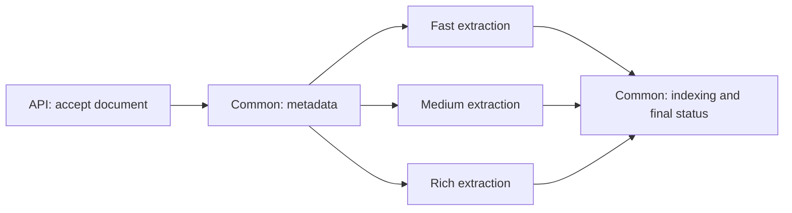

# Ingestion: workers, queues and performance

Reference for the Knowledge Flow ingestion architecture.
**Branch status:** normal-path local test passed; failure recovery and production sizing remain to validate.

## The path of one document

Each document takes **one** extraction path, selected by its profile.
Indexing includes chunking and embeddings. Extraction stays a single activity:
we do not distribute individual PDF pages or OCR calls across Temporal workers.

**Example:** two rich PDFs and five fast documents arrive. With one rich slot,
the second rich waits; the fast worker can continue. When the first rich finishes
extraction, its indexing goes to common while the second rich starts extraction.

## Four roles, four queues

Queue names below assume `scheduler.temporal.task_queue: ingestion`.

| Role | Queue | What it executes | Initial activity slots per process/pod |
| --- | --- | --- | ---: |
| Common | `ingestion` | All workflows; metadata, progress, indexing, revectorization, repair, PDF-render expiry | 3 |
| Fast | `ingestion-fast` | Fast extraction only | 4 |
| Medium | `ingestion-medium` | Medium extraction only | 2 |
| Rich | `ingestion-rich` | Rich extraction only | 1 |

A **workflow** is the durable scenario; an **activity** is a concrete operation.
All workflows run on common. Extraction workers register only push/pull extraction
activities, no workflows. A **Fred UI task** follows a document through these steps.
It is not another worker or another queue.

A waiting workflow consumes no activity slot. Common also has a separate limit
for short workflow execution/replay turns, not for the number of documents followed.

**Two different limits:** `ingestion_workflow_parallelism: 3` admits up to three
documents **per profile, per submission**. Worker activity slots bound actual
execution across submissions. Three admitted rich documents can therefore mean
one extracting and two waiting. This is not a global submission limit.

## What DevOps deploys

| Mode | Worker layout | Purpose |
| --- | --- | --- |
| Everyday local development | One process serves all four roles/queues | Simple setup; profiles share resources |
| Local isolation test | Four processes, one role each | Verify routing and concurrency on one machine |
| Kubernetes | Four deployments, one role per deployment | Independent replicas, CPU and RAM per profile |

Docker Compose supplies infrastructure; the API and workers still need to be
started. The memory scheduler does not exercise Temporal. See the
[configuration guide](../../../apps/knowledge-flow-backend/config/README.md) for local commands.

The API and workers must agree on **Temporal server, namespace, base queue,
profile policies and shared stores/models**. Temporary paths are not shared:
each stage restores its input from shared content storage and saves its output
there. Temporal carries references, not document bytes.

Helm extraction deployments inherit common settings through `inheritFrom`;
**the API is configured separately**. The chart checks that all four roles have
consumers. The k3d variant uses one worker serving all roles.

**Scaling example:** two rich replicas with one slot each permit two simultaneous
rich extractions on the same queue. Increasing RAM helps a large PDF fit;
increasing replicas helps queued PDFs start. Raising slots also raises per-pod
resource pressure. The initial table values are not measured sizing recommendations.

## Where is time being spent?

| Observation | What to check | Example / interpretation |
| --- | --- | --- |
| Document waits before extraction | Profile queue, consumer presence, queue-wait metric | Rich is full while fast is idle: inspect rich capacity, not fast |
| Extraction itself is slow | Activity duration, extraction child CPU/RAM, OCR/model calls | Low queue wait + long execution: another replica will not accelerate this document |
| Extraction finished, document still processing | Common output activity and downstream stores/model | Embeddings or indexing may be slow even when extraction workers are idle |
| Attempts repeat | Temporal activity history, timeout/error, pod restarts/OOM | More retries can hide repeated failure; inspect the cause before scaling |
| Parent workflow is Completed but a document failed | Document status and parent's `{total, processed, failed}` | Parent completion does not mean every document succeeded |

Use role/queue startup logs, workflow IDs and document IDs to follow the path.
The [metrics reference](../../../apps/knowledge-flow-backend/docs/metrics/WORKFLOW_SCHEDULER.md)
describes actual emission coverage and label filtering. Per-queue/stage Prometheus
labels are not available yet; the queue-wait helper currently covers metadata only.
Queue-wait observations appear
when an activity starts: they cannot alone detect a queue with no consumer.
Measure pod **and extraction-child** memory; the parent worker's memory alone misses heavy extraction.

## Robustness and current limits

Stage deadlines bound **execution per attempt**, not time waiting in a queue.
Metadata preparation, extraction and indexing use the selected profile's retry
policy. `retry_maximum_attempts` includes the first attempt; errors explicitly
classified as non-retryable fail immediately. See the
[configuration guide](../../../apps/knowledge-flow-backend/config/README.md#ingestion-timeouts-and-retries)
for the fields and defaults.

There is **no overall document deadline**. Queue waits, workflow scheduling and
progress persistence add time beyond the activity attempts and retry delays.
A missing consumer can leave a document waiting indefinitely. Configuration is
copied into the submitted payload: changing YAML does not alter existing runs.
`[INGESTION POLICY]` logs that payload's effective policy once per document;
`[INGESTION ATTEMPT]` logs outcomes where the activity KPI helper is called.
Temporal history remains authoritative for retries, timeouts and worker loss.

A document succeeds only after indexing completes and its terminal task event is
persisted. An exhausted or non-retryable failure produces a failed task; its
siblings continue. If the parent ends without a document's terminal event,
task reconciliation reports failure rather than inventing success.

For ingestion tasks, the first committed terminal outcome is final. Sequence
allocation and the terminal guard share the journal transaction. A failed live
notification does not turn a committed success into a failure: an idle SSE stream
catches up from the journal every 30 seconds. This is a recovery poll, not a
real-time guarantee when notifications are unavailable.

Failure messages retain the preparation/extraction/indexing step and unwrap
Temporal orchestration errors to expose the cause. Exhausted activity attempts
are named only when Temporal reports them. Resource error details include a
copyable document reference; task details include the task reference as well.
Resources reads terminal history after reload, including explicit failed/succeeded
queries for personal space. The global task tray still restores only active tasks;
restoring its historical failures and retrying its initial fetch remain separate.

**User cancellation is deferred.** The document menu has no Stop ingestion action;
the task cancellation endpoint rejects ingestion tasks with HTTP 409 after the
normal authorization check. Deletion stays disabled while ingestion is active.
Technical cancellation for deadlines and worker shutdown remains internal.

Extraction runs in a spawned child process. The parent heartbeats, and technical
cancellation or the local deadline triggers process-group cleanup. Heartbeats
report contact, not useful progress; they neither stop computation nor prevent
overlapping attempts. Unconfirmed child termination forces the worker to exit
rather than release its activity slot or delete working files.

A Temporal timeout ends an attempt logically; it does not guarantee immediate
physical termination of an indexing thread. Timeout/retry overlap still needs
fault-injection validation.

**Before production sign-off:** validate worker loss, indexing retries, deadline
exhaustion and resource sizing. Recovery after fail-stop, orphan descendants and
overlapping writes after network partitions remain to validate. Per-image OCR/VLM
metrics are currently lost in the child process; spawn overhead remains to measure.
**Drain ingestion before deploying this branch**; old in-flight histories are
outside its scope. User cancellation and its cleanup semantics require a separate
design and are not acceptance criteria for this delivery.

Local evidence (2026-09-21): **11 PDFs completed — 5 fast, 4 medium, 2 rich**.
Logs confirmed profile routing, one rich extraction at a time, fast/medium finishing
while rich ran, and indexing on common. These were separate profile submissions,
not a single mixed-profile admission test or a Kubernetes load test.

The Control Plane lifecycle worker is separate. Folder deletion currently runs
in the Knowledge Flow API and can block resource browsing during bulk deletion.
The existing [OpenSpec change](../../../openspec/changes/isolate-ingestion-extraction-queues/tasks.md)
is frozen under the local collaboration agreement; its cancellation scenarios
do not describe the scope of this delivery.
