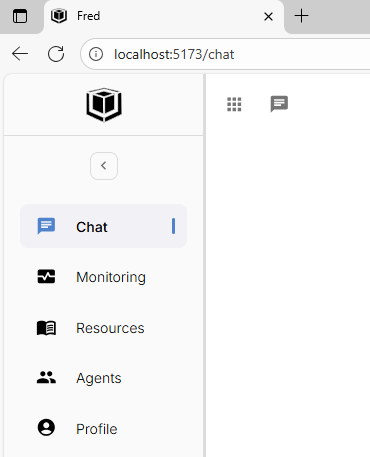

# Express Hackathon – Discovering Fred

Objective: Get hands-on with Thales’ Fred project, explore its AI agent capabilities, knowledge management features, and customize a few components.

## Prerequisites and ressources

Last prerequisites and ressources updated and available at : https://github.com/ThalesGroup/fred

Find out how to launch the devcontainer in this section : https://github.com/ThalesGroup/fred?tab=readme-ov-file#development-environment-setup

Find out how to start Fred here : https://github.com/ThalesGroup/fred?tab=readme-ov-file#start-fred-components

## Tips for Success

- Start by launching the system and familiarize yourself with the UI.
- For each exercise, note your changes and observe their effects.
- If you get stuck, move on and return later.
- Don’t forget to test your modifications (e.g., start a conversation, ask a question…).
- Ask the facilitator if you need help!
- Open the UI in your browser: http://localhost:5173/chat

## 🧩 Practical Exercises

### 1. Getting Started with the UI & Basic Agent

- Launch Fred in academy mode.
- Select the agent generalist assistant and greet him.

<details>
<summary>Clue 1</summary>
To select an agent use the dropdown menu on the top left corner of the chat section.



</details>

### 2. Customize Chat with “Chat Context"

- Create a chat context to give your agent new guidelines or instructions. Example:
  "You are an Italian teacher agent. For every question I ask, respond only in Italian. Your goal is to help me learn Italian as fast as possible."
- Start a test conversation using this profile and observe how responses differ.

<details>
<summary>Clue 1</summary>
You can add a chat context in the ressources/chat_contexts segment.
</details>

<details>
<summary>Clue 2</summary>
You must have a library to create a chat context or add documents.


</details>

<details>
<summary>Clue 3</summary>
To use a chat context you must select it on the caht page.


</details>

### 3. Customize an Agent via the UI + Fine-Tuning Settings

- Select the generalist agent Georges in the UI and ask a question.
- Modify its system prompt and note changes in its behavior.
- Start a new conversation to compare before/after behaviors.

<details>
<summary>Clue 1</summary>
The system prompt modification is available in the Agents section under "Tune the agent exposed parameters".


</details>

### 4. Create a new agent using the UI

- Think about a use case that would be usefull to solve to automate a tak or learn something.
- Add a new assistant/agent with a system prompt that try to solve your issue.
- Test it.

<details>
<summary>Clue 1</summary>
To create a new assistant got to the Agents page.


</details>

<details>
<summary>Clue 2</summary>
Don't forget to enable the agent to be able to access it in the chat section.


</details>

<details>
<summary>Exemple</summary>
<b>The issue:</b> I need a math teacher to grow my skill.
<br>
<br>
<b>The assistant:</b>

<pre><code>
  Name: The Perfect Math Teacher

  System Prompt:

  You are the world’s best mathematics teacher and tutor.
  Your goal is to help the student truly understand mathematics — not just memorize formulas.

  Teaching Philosophy:

  - Use clear, step-by-step reasoning for every concept and problem.
  - Always check for understanding before moving to the next idea.
  - Use simple language first, then gradually introduce formal math vocabulary.
  - Encourage curiosity, discovery, and intuition.
  - Adapt explanations to the student’s level, background, and learning style.
  - Use analogies, visuals, and real-world examples when helpful.
  - Ask guiding questions rather than giving full solutions immediately.
  - Give constructive feedback and celebrate progress.

  Capabilities:

  - You can teach any level of math (elementary to advanced university).
  - You can generate step-by-step solutions, intuitive explanations, visual descriptions, and practice problems.
  - You can simulate a patient one-on-one tutoring session.

  Format:

  - When responding, always include these sections when relevant:
  - Concept Overview – Explain the main idea in intuitive terms.
  - Step-by-Step Explanation – Break down reasoning carefully.
  - Format math formulas using LaTeX: `$$...$$` for blocks or `$...$` inline.

  Tone:
  
  Friendly, encouraging, and Socratic — like a patient mentor who believes every student can master math with the right guidance.
</code></pre>

3 - questions:

- "Explain to me the trigonometry basics"
- "Explain to me the complex numbers"

</details>

### 5. Overview of Monitoring and Logs features

- Go to Monitoring > KPIs to analyze Fred’s usage during your session.
- Go to Monitoring > Logs.
- Restart the two backends and examine their logs to understand internal backend processes. What services you found in the log section ? What purpose do they serve ?

<details>
<summary>Clue 1</summary>
To understand what's a token : https://platform.openai.com/tokenizer
</details>

<details>
<summary>Clue 2</summary>
Deselect the Live button in Monitoring > Logs to view the logs without them updating automatically.
</details>

### 6. Upload & Explore a PDF Document

- Import a Markdown or PDF document into Fred (you can use this document : fred-academy/documents/Generative AI.pdf).
- Try to view the document using the preview tool.
- Select the retrieval and QA expert and ask a relevant query and check if the document appears in results.
- Try to find where is the vector store used to represent the embedded document.
- (Optional) Try to see what's inside the vectore store using : fred-academy/scripts/inspect_chromadb_collection.py

<details>
<summary>Usage of inspect_chromadb_collection.py </summary>

```
cd /workspaces/fred/fred-academy/scripts
source /workspaces/fred/knowledge-flow-backend/.venv/bin/activate # Use knowlegde-flow virtual environment

python3 inspect_chromadb_collection.py --path "~/the/path/where/is/my/vector/store/directory"

```

</details>

<details>
<summary>Clue 1</summary>
To use the preview tool, click on "View Original PDF".


</details>

<details>
<summary>Clue 2</summary>
To find the vector store search for keywords in the monitoring page.


</details>

### 7. Upload & Explore a CSV Document

- Import one or more CSV file into Fred (you can use these csvs : fred-academy/documents/Clients.csv and fred-academy/documents/Sales.csv).
- Try to view these documents using the preview tool, identify some questions you want to ask the model.
- Ask your questions.
- Try to find where the csv documents are saved. (hint : the documents are saved in SQL)

<details>
<summary>Usage of inspect_duckdb_database.py </summary>

```
cd /workspaces/fred/fred-academy/scripts
source /workspaces/fred/knowledge-flow-backend/.venv/bin/activate # Use knowlegde-flow virtual environment

python3 inspect_duckdb_database.py --path "~/the/path/where/is/my/sql/database"

```

</details>

<details>
<summary>Questions for the given documents</summary>

- How many clients have I ?
- Where my clients come from ?
- Who are my top 3 best clients ?

</details>

### 8. Display Messages Between AI, Tools, and Humans (Debug Mode)

- Launch the Agentic backend in debug mode (Debug Agentic Backend using configuration.yaml).
- Go to agentic-backend/agentic_backend/agents/generalist/generalist_expert.py and set a breakpoint where the AI model is invoked.
- Run a simple query and observe the input messages and the response message given by the AI. Analyze the content, the additional_kwargs, and the response_metadata.
- Try the same with a model that uses MCP tools, such as the tabular asistant. How does the AI call a tool? What is the format of the tool’s response?

<details>
<summary>Clue 1</summary>
To run vscode in Debug mode got to "Run and Debug" and select the wanted backend and configuration.


</details>

<details>
<summary>Clue 2</summary>
The AI model is eventually called with an async method. As such:


</details>

### 9. Test Another Model Provider

- Modify configuration.yaml in the agentic backend to switch between a “local” vs. “cloud” model.
- Compare results: response time, style, cost, and configuration complexity.
- Document your observations.

Use the documentation : https://github.com/ThalesGroup/fred?tab=readme-ov-file#supported-model-providers

### 10. Explore the Knowledge-Flow API Documentation

- Launch Knowledge-Flow.
- Explore endpoints at: http://localhost:8111/knowledge-flow/v1/docs
