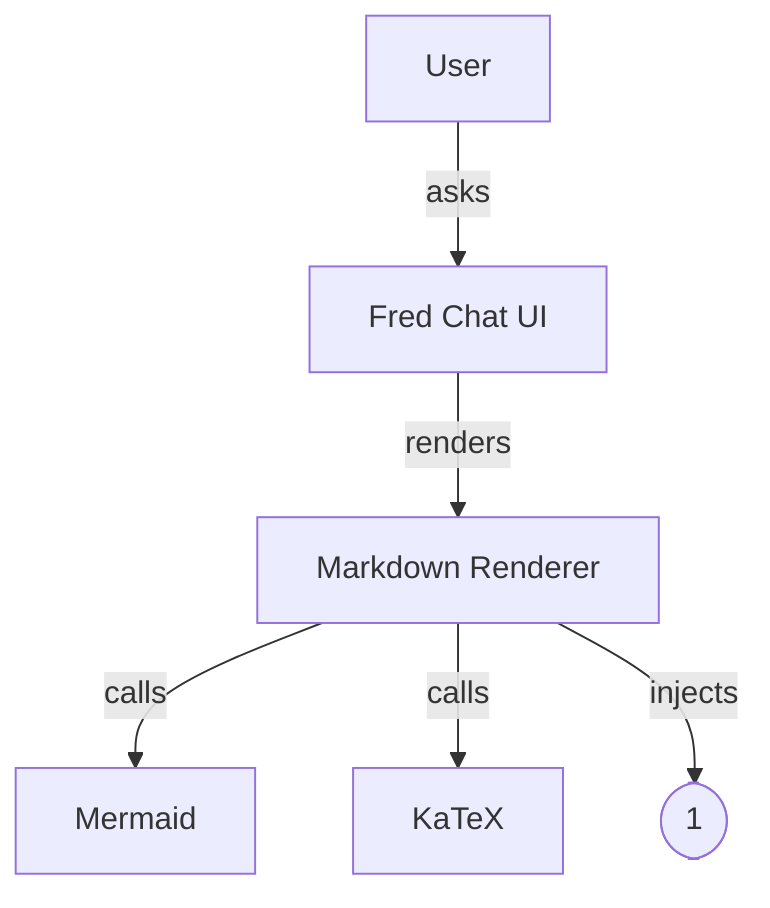

# 🧪 Renderer Torture Test

This page tries to exercise most things your renderer supports: headings, lists, code fences (nested), Mermaid, KaTeX, tables, details, images, links, blockquotes, tasks, **citations** like [1] and [2], and some sanitized HTML.

## Code

Test JSON (should be formatted):

```java
public class DataProcessor {
  private int counter = 0;

  public void processItem(String item) {
    System.out.println("Processing: " + item);
    counter++;
  }

  public int getCount() {
    return counter;
  }
}
```

---

SELECT c.customer_id, c.first_name, c.last_name, a.city, o.order_date, SUM(oi.quantity \* oi.price) AS total_spent FROM customers c JOIN addresses a ON c.address_id = a.address_id JOIN orders o ON c.customer_id = o.customer_id JOIN order_items oi ON o.order_id = oi.order_id GROUP BY c.customer_id, o.order_date ORDER BY total_spent DESC LIMIT 50;

---

## Lists & Inline

- Regular list item with **bold**, _italic_, `inline code`, and math $E=mc^2$.
- Stage directions to test emoji pass: adjusts glasses, smiles, shrugs, nods, laughs, sighs, grins, winks, clears throat.
- A link to [OpenAI](https://www.openai.com).

> Blockquote with **markdown** inside and a [3] citation.

---

## Table

| Col A | Col B | Col C |
| ----: | :---: | :---- |
|   123 |  mid  | left  |
|   456 |  mid  | left  |

---

## Tasks

- [x] Render headings, lists, tables
- [x] Run Mermaid
- [x] Render KaTeX
- [x] Highlight search terms
- [ ] Zoom a diagram

---

## Mermaid (should adopt theme)



---

## KaTeX

Inline: $P(X \le x) = \int_{-\infty}^{x} f(t)\,dt$
Block:

$$
\int_{0}^{\infty} e^{-x^2}\,dx = \frac{\sqrt{\pi}}{2}
$$

## Nested fences inside an outer markdown sample

````markdown
# This should remain a _markdown sample_, not render as real headings.

Here is a code block inside:

```python
def hello():
    print("Hello, nested fences!")
```

And back to plain text inside the _same_ outer block.

(Everything above stays monospaced until the four-backtick close.)
````

Here is a code block outside:

```python
def hello():
    print("Hello, nested fences!")
```

---

## Details / Disclosure

:::details[Why a custom renderer?]
Because we need theme-aware Mermaid, KaTeX, [1] citations, highlight & zoom that match the Fred UI.
:::

---

## Image


---

## Raw HTML (should be sanitized)

<div>Safe DIV should remain.</div>
<script>alert("this should be removed by sanitize");</script>

---

## Citations sanity

Text mentioning sources [1] and [2] should become clickable `<sup class="fred-cite">` nodes to sync with your Sources panel.

---

## Long code block

```ts
type ChatMessagePayload = {
  session_id: string;
  exchange_id: string;
  rank: number; // monotonic within an exchange
  role: "user" | "assistant" | "system";
  channel?: "stream" | "final" | "plan" | "thought";
  parts: Array<{ type: "text"; text: string }>;
  metadata?: Record<string, unknown>;
};
```

---

## End

If you can read this, the nested fences didn’t eat the rest of the page. ✅
