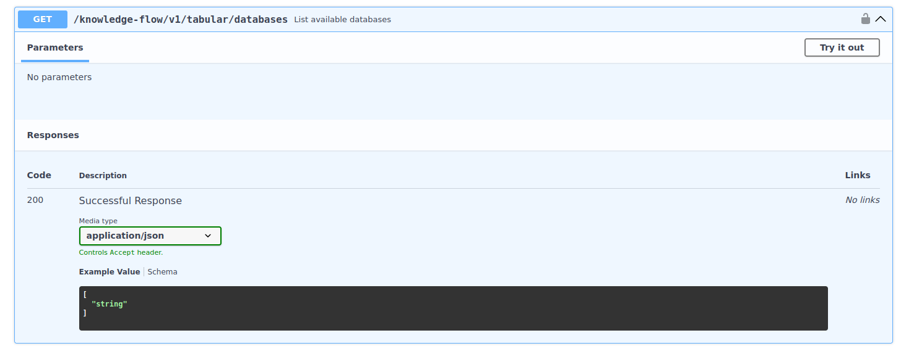

# **Hackathon La Poste — Use case IoT**

**Objectifs techniques**

- Mettre en place un serveur MCP connecté à une base SQL, afin de permettre à un LLM d’interroger directement des données IoT.
- Créer un agent dynamique Fred capable de générer automatiquement des requêtes SQL via ce serveur MCP.
- Développer un agent statique basé sur LangGraph, destiné à orchestrer des vérifications, des règles métier et des décisions automatisées.

**Objectif métier**

- Proposer un cas d’usage concret pour La Poste, illustrant comment ces agents peuvent analyser des données de capteurs (IoT), détecter des anomalies et assister les équipes opérationnelles.

Sommaire : 

- [0 - Mise en place de l'environnment](#0---mise-en-place-de-lenvironnment)
- [1 - Mise en place du postgres SQL et connexion à knowledge-flow](#1---mise-en-place-du-postgres-sql-et-connexion-à-knowledge-flow)
- [2 - Exploration de la documentation FastAPI](#2---exploration-de-la-documentation-fastapi)
- [3 - Exposer les endpoints FastAPI en MCP avec FastAPI-MCP](#3---exposer-les-endpoints-fastapi-en-mcp-avec-fastapi-mcp)
- [4 - Utiliser le serveur MCP créé précédemment avec un agent dynamique depuis la UI](#4---utiliser-le-serveur-mcp-créé-précédemment-avec-un-agent-dynamique-depuis-la-ui)
- [5 - Création d'un agent statique dans agentic-backend depuis un template](#5---création-dun-agent-statique-dans-agentic-backend-depuis-un-template)
- [6 - Le use case IoT](#6---le-use-case-iot)
- [7 - \[Optionnel\] Revoir l'ensemble du cas d'usage avec le serveur MCP IoT mis à disposition en interne](#7---optionnel-revoir-lensemble-du-cas-dusage-avec-le-serveur-mcp-iot-mis-à-disposition-en-interne)


# 0 - Mise en place de l'environnment

Exécuter dans un terminal :

```bash
git cherry-pick 8aca609c            # Met à jour Fred pour le hackathon
```

# 1 - Mise en place du postgres SQL et connexion à knowledge-flow

## 1.1 - Lancer un Postgres SQL sur votre devcontainer

- Se placer dans le dossier suivant: 

  ```bash
  cd hackathon_laposte/use_cases/iot/
  ```

- Donner les droits d'exécution au script `setup_postgres.zsh` :

  ```bash
  chmod +x setup_postgres.zsh
  ```

- Exécuter le script :

  ```bash
  ./setup_postgres.zsh            # Première installation assez longue (<= 10min)
  ```

<details>
<summary>Quelques commandes postgres</summary>

Connexion à la base de données en ligne de commande :

```bash
psql -h localhost -U postgres -W # entrer le mot de passe ("postgres")
```

Lister les bases de données du postgres :

```bash
\l
```

Utiliser la base de données `base_database`:

```bash
\c base_database; # entrer le mot de passe ("postgres")
```

Créer une table et insérer une ligne:

```bash
CREATE TABLE ma_table (
    id INTEGER PRIMARY KEY,
    nom TEXT,
    valeur FLOAT
);

INSERT INTO ma_table (id, nom, valeur)
VALUES (1, 'Exemple', 12.34);
```

Lister les tables :

```bash
\d
```

Afficher la ligne nouvellement ajoutée dans `ma_table` :

```bash
SELECT * FROM ma_table;
```

</details>

## 1.2 - Configurer knowledge-flow backend pour ajouter la base de données PostgreSQL

Dans le fichier `knowledge-flow-backend/config/configuration.yaml`, remplacer dans la section `tabular_stores` :

```yaml
tabular_stores:
  postgres_store:
    type: "sql"
    driver: "postgresql+psycopg2"
    host: "localhost"
    port: 5432
    database: "base_database"
    username: postgres
    password: postgres
    mode: "read_and_write"
```

# 2 - Exploration de la documentation FastAPI

"Knowledge Flow" est le composant backend de Fred dédié à la gestion des connaissances : ingestion de documents, transformation, vectorisation, recherche, etc.

Il supporte plusieurs types de données : documents non structurés (PDF, Markdown), mais aussi des données structurées comme des CSV et des bases SQL.

Le backend Knowledge-flow expose des API (via FastAPI) pour manipuler les documents et les données disponibles.

L'objectif de cette section est de découvrir les endpoints mis à disposition par l’API Tabular de Knowledge Flow.

## 2.1 - Ingestion de documents d'exemples

Pour ingérer quelques documents afin d'avoir des tables disponibles, nous vous conseillons de démarrer Fred et d'ajouter ces documents dans la section ressources :

- `fred-academy/documents/Clients.csv`
- `fred-academy/documents/Sales.csv`

## 2.2 - Quelques exercices sur les endpoints Tabular de knowledge-flow

Retrouvez la documentation FastAPI ici : `http://localhost:8111/knowledge-flow/v1/docs`. 

Intéressez-vous plus particulièrement aux endpoints de la section "Tabular".

Voici la liste des questions à explorer pour comprendre les différents endpoints disponibles dans cette section :

- Y a-t-il besoin de paramètres en entrée ?
- Qu’est-ce qu’il renvoie (format et contenu) ? Comment cela pourrait-il être utilisé par un LLM ?
- Que se passe-t-il en cas d’erreur dans le corps de la requête ?

Essayez ensuite d'effectuer les actions suivantes

<details>
<summary>Recommandations pour tester les endpoints API</summary>

Il est recommandé de tester les endpoints directement sur la page de documentation via la fonctionnalité "Try it out", présente à droite de l'en-tête "Parameters" de chaque endpoint


</details>

### a - Lister les bases de données disponibles

### b - Lister les tables disponibles pour, au moins, une base de données

### c - Utiliser l'endpoint de contexte

### d - Récupérer le schéma d'une des tables à votre disposition

### e - Essayer avec un nom de table qui n'existe pas.

### f - Exécuter une commande SQL simple

<details>
<summary>Exemples de commandes SQL</summary>

```sql
SELECT * FROM table_name LIMIT 10;
```

```sql
SELECT COUNT(*) FROM table_name;
```

</details>

### g - Essayer avec une commande ou un nom de table erroné

### h - Créer une colonne supplémentaire dans votre base avec l'endpoint `write_query`

Idée : créer une colonne `big_sale` si `amount` est supérieur à 250.

<details>
<summary>Exemple de commande Postgres SQL pour créer une colonne</summary>

```sql
ALTER TABLE sales ADD COLUMN new_column new_column_type; UPDATE sales SET new_column = value WHERE condition;
```

</details>

### i - Essayer de créer cette même colonne avec l'endpoint `read_query`

### j - Créer une table supplémentaire

<details>
<summary>Exemple de commande SQL</summary>

```sql
CREATE TABLE nouvelle_table (
    id INTEGER PRIMARY KEY,
    nom TEXT,
    valeur FLOAT
);
```

</details>

### k - Supprimer la table créée ci-dessus

# 3 - Exposer les endpoints FastAPI en MCP avec FastAPI-MCP

## 3.1 - Identifier comment les autres endpoints sont exposés avec FastAPI-MCP

### 3.1.a - Identifier où sont créés les endpoints de l’API Tabular

Chaque type de service est décomposé en deux parties :

- un service qui instancie la logique derrière le controller ;
- un controller qui expose différentes commandes (GET, UPDATE ou DELETE) définies dans le service.

<details>
<summary>Indice</summary>
Rechercher dans le backend knowledge-flow.
</details>

### 3.1.a - Identifier où et comment ces endpoints sont exposés ?

<details>
<summary>Indice</summary>
En général, l’exposition via FastAPI des endpoints d’un backend se fait dans son fichier `main.py`.
</details>

### 3.1.a - Regarder comment les autres services sont exposés en MCP

Etudier comment est créé le serveur MCP : `mcp-statistic`.

<details>
<summary>Indice</summary>
Rechercher dans tous le dossier courant de VSCode (`ctrl+shift+f`): <code>mcp-statistic</code>
</details>

## 3.2 - Ajouter le code nécessaire à la création du serveur mcp : **mcp-tabular**

<details>
<summary>Indice</summary>
Le tag des endpoints tabular est : <code>Tabular</code>.
</details>

## 3.3 (OPTIONEL) - Vérifier le serveur MCP avec MCP-inspector

# 4 - Utiliser le serveur MCP créé précédemment avec un agent dynamique depuis la UI

Fred permet de créer des agents MCP depuis la UI (aussi appelé agent "dynamique"). Nous allons utiliser cette fonctionnalité pour tester le serveur MCP créé précédemment.

## 4.1 - Ajouter le serveur MCP à la configuration

Dans `agentic-backend/config/configuration.yaml`, ajouter dans la section `servers` :

```yaml
servers :
    - name: "mcp-knowledge-flow-mcp-tabular"
        transport: "streamable_http"
        url: "http://localhost:8111/knowledge-flow/v1/mcp-tabular"
        sse_read_timeout: 2000
        auth_mode: "user_token"
```

## 4.2 - Créer un agent MCP depuis l’UI

- Aller sur la page **Agents** et cliquer sur **Créer**.
- Remplir les champs sans oublier d’ajouter le serveur MCP créé.

<details>
<summary>Indice</summary>
N'oubliez pas d'activer l’agent après l’avoir créé.
</details>

## 4.3 - Tester l'utilisation des endpoints de la section 2.2 avec l’agent créé

- Arrive-t-il à utiliser tous les endpoints ?
- Tous les endpoints sont-ils nécessaires ?
- Quels sont les axes d’amélioration ?

# 5 - Création d'un agent statique dans agentic-backend depuis un template

L'idée de cette section est de reconstruire "à la main" ce qui a été précédemment fait via la UI lors de la création de l'agent dynamique. 

L'intérêt dans le cadre du hackathon est de permettre aux participants de "mettre les mains dans le cambouis" afin d'être en capacité de créer, en autonomie, toute sorte d'agent beaucoup plus complexe par la suite.

En effet, cette manière de construire des agents directement via des fichiers de code python (d'où le nom d'agent "statique) implique d'aborder LangGraph, qui est le framework Python à la base de toute la composante agentique de Fred.

LangGraph est un framework open-source construit sur LangChain qui permet de créer des agents et workflows d’IA structurés sous forme de graphes. Il facilite la définition d’états, de transitions et de boucles pour contrôler précisément le comportement d’un agent. Grâce à son architecture déterministe, il améliore la fiabilité et la traçabilité des systèmes basés sur les LLM. Il est particulièrement adapté aux applications nécessitant des interactions complexes.

Conseil : travailler par étapes : un premier agent fonctionnel, puis un agent qui utilise MCP, puis itérer pour améliorer.

## 5.1 - Exploration de la mise en oeuvre de l’agent Statistic

### 5.1.a - Analyse du code de l’agent Sage

Rendez-vous ici : `agentic-backend/agentic_backend/agents/statistics/statistics_expert.py`

- Quels paramètres sont modifiables ?
- Comment est défini le graphe ? Qu’est-ce qui permet de lier le graphe et les tools MCP ?

### 5.1.b - Configuration de l’agent

Explorer les références à Sage dans :  
`agentic-backend/config/configuration_academy.yaml`

Note : ce fichier permet de lancer Fred en mode "academy" avec des agents de démonstration qui exposent d'autres capacités et serveurs MCP.

## 5.2 - Adapter l’agent Sage pour construire un nouvel agent avec le serveur MCP créé

### 5.2.a - Récupérer le code de l’agent Sage

- Copier le fichier `statistics_expert.py` dans un nouveau dossier `tabular` : `agentic-backend/agentic_backend/agents/tabular/`
- renommer le `tabular_expert.py`

### 5.2.b - Modifier le code pour obtenir un agent qui requête le serveur MCP

Une première itération peut consister à modifier la section `STATISTIC_TUNING`, le nom du modèle et de la classe Sage, afin d’obtenir rapidement un agent fonctionnel partageant le même graphe mais utilisant un system prompt et un serveur MCP différents.

### 5.2.c - Ajouter l'agent créé à votre fichier de configuration

Pour ajouter un agent statique dans Fred : dans `agentic-backend/config/configuration.yaml`, ajouter à la section `agents` :

```yaml
agents:
  - name: "agent_name"
    type: "agent"
    class_path: "agentic_backend.agents.agent_folder.python_filename.agent_class_name"
    enabled: true
```

## 5.3 - Tester cet agent avec les questions de la section 2.2

# 6 - Le use case IoT

**Introduction**

L'objectif de ce use case est de monitorer les capteurs installés sur les caisses mobiles de La Poste. Ces capteurs retracent les trajets effectués par chaque caisse et permettent de s'assurer que la bonne caisse arrive au bon endroit.

**Présentation des fichiers**

Le use case s'appuie sur trois fichiers :

- `suivi_appairage.csv` : document de suivi d’appairage des capteurs, avec deux statuts : succès et échec. En cas d’échec, un message d’erreur peut apparaître dans `ErrorMsg`.
- `gestion_maintenance.csv` : document de suivi de la maintenance des capteurs de position ; permet de suivre leur statut (appairé non mis en œuvre, appairé et mis en œuvre, à retirer, retiré).
- `analyse_positions.csv` : mesures des capteurs installés, incluant localisation et vitesse.

## 6.1 - Téléchargement des fichiers depuis Cryptobox

## 6.2 - Ingestion des fichiers dans la base de données depuis l’UI de Fred

- Importer les fichiers CSV téléchargés dans Fred depuis la page `ressources>documents`.

>**Note**: le fichier `analyse.csv` prend 2 à 3 minutes à être ingéré car très volumineux.

## 6.3 - Résolution des problématiques

> **Conseils**
>
>- Relancer une conversation par problématique améliore le résultat et réduit la consommation de tokens ;
>- Demander à votre agent de créer des colonnes intermédiaires améliore les réponses et laisse une trace ;
>- Indiquer le SGBD utilisé permet à l’IA de formuler des requêtes adaptées : ici Postgres.

### Exploration des données

- Compter le nombre de lignes par table
- Analyser les données de chaque table
- Compter le nombre de capteurs.

### Installations non opérantes

- Rechercher les capteurs installés mais non appairés, puis vérifier s’ils apparaissent dans le log des erreurs.
- Parmi ceux-ci, identifier ceux absents des logs : cela indique que le fournisseur ne les a pas enrôlés (absence d’émission).

### Capteurs en panne

- Créer une table contenant, pour chaque capteur, sa dernière émission.
- Identifier les capteurs Ineosense n’ayant pas émis depuis plus de 48 h depuis le 22 octobre 2025 à 16:18.
- Identifier ceux qui n’ont pas émis depuis plus de 100 h : ils sont HS.
- (~) Comparer les dernières transmissions sur plusieurs jours pour repérer les fluctuations.

### Vérification des émissions

- Vérifier que le délai entre capture et réception est < 2 minutes par capteur. Observer la stabilité temporelle.

<details>
<summary>Indice</summary>
- Créer une colonne <code>diff_mesure_reception</code>.  
- Créer une vue avec moyenne, médiane, minimum, maximum, quartiles et écart type.
</details>

- Vérifier qu’un capteur émet toutes les 15 minutes.

<details>
<summary>Indice</summary>
- Créer une colonne mesurant la différence entre le temps de réception n et n-1 .  
- Créer une vue avec moyenne, médiane, minimum, maximum, quartiles et écart type.
</details>

### Comportement en entrée et sortie de plateforme

Constater que :

- (~) en sortie de PF, un capteur peut se réveiller tardivement ; un délai élevé peut indiquer un mauvais réglage ;
- (~) en entrée de PF, un capteur peut ne pas envoyer de message au moment précis de l’arrêt.

### Analyse de la qualité du back-office fournisseur

Constater que :

- (~) en cas d’engorgement, les données arrivent avec des réceptions proches et un délai capture–réception qui diminue. On doit pouvoir détecter début et fin de l’engorgement ;
- (~) des délais capture–réception presque égaux au délai entre deux positions peuvent indiquer un mélange de dates.

# 7 - (OPTIONEL) - Revoir l'ensemble du cas d'usage avec le serveur MCP IoT mis à disposition en interne
