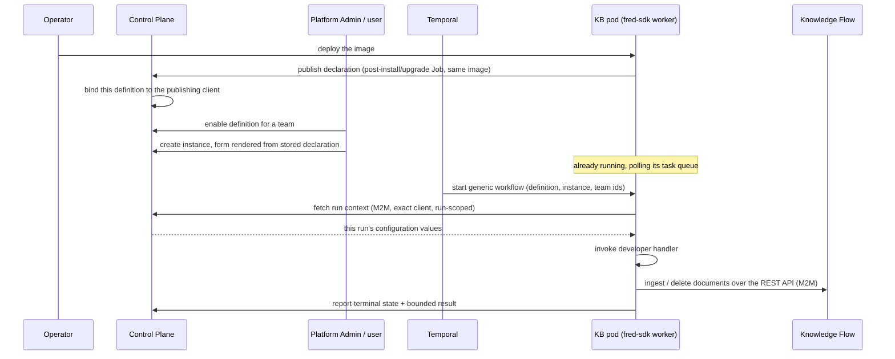

## Context

See proposal.md — Why. Two repository facts shape this design. They were
established by an earlier focused audit and are restated only as constraints:

- The existing agentic pod is a pure HTTP runtime and uses no Temporal. A KB
  pod cannot be modelled on it.
- The field vocabulary a configuration form needs — `FieldSpec`, `FieldType`
  including `secret`, `UIHints` — exists and is already rendered by the
  frontend.

The product constraint that drives everything else: the KB pod is outbound-only.
Temporal must not call it over HTTP and Kubernetes must not need an inbound
service for it. A Temporal worker polling a task queue satisfies both, because
polling is an outbound connection.

## Published versus online

This distinction is load-bearing and easy to lose.

A **published** definition is one whose image posted a declaration at deployment
time. That is a static fact: this image was deployed, and this is the shape of
the configuration it expects.

**Online** would be a fact about a running pod — that a worker is polling, that
the source is reachable, that the last run succeeded. Fred establishes none of
these, and this design deliberately gives it no way to. There is no discovery,
no heartbeat and no liveness registry.

Publication carries the first fact and never the second. A published declaration
is never expired, never deregistered and never read as evidence that anything is
running: it says an image was deployed, not that a pod is alive now.

The consequence is accepted openly: a Platform Admin can enable, and a user can
create and configure, a Knowledge Base whose pod is no longer running. A run
dispatched to it then times out according to the configured Temporal timeouts
and is recorded as a failed run. Failure is observable but not immediate, and
the UI must never imply otherwise.

## Goals / Non-Goals

**Goals:**

- An author writes a declaration and one handler, and never encounters Temporal.
- A team creates and configures its own instances, from a form Fred renders out
  of the fields the pod declared — and chooses on that same form when the
  instance runs.
- A run reports what its author thinks is worth reporting, in the author's own
  vocabulary, and Fred displays it well without interpreting it.
- One vertical slice provable end to end: published → enabled → instance
  configured → dispatched → handler called → documents ingested through
  Knowledge Flow's REST API → result recorded.

**Non-Goals:**

- Everything the implementation owns: discovery, parsing, change detection,
  reconciliation, and the **durable synchronization ledger** — source document
  identity, source version history, revisions/ETags/hashes, mappings to Fred
  document UIDs, cursors, tombstones and the last successful inventory. No
  generic Fred-side or SDK-side synchronization-state store is designed here,
  and no requirement prescribes how an implementation versions or persists that
  state.
- Liveness, leases, heartbeat registries, deregistration, "online" status.
- Scale-to-zero and schedule-time pod activation.
- An asynchronous result callback protocol.
- Interpreting what a run reports. Fred renders the author's report; it never
  reads it, aggregates it, or acts on it.
- **A new Knowledge Flow ingestion boundary.** An implementation uses the REST
  API Knowledge Flow already exposes. Whatever that API enforces is what is
  enforced; improving it is an outcome of this slice, not a precondition of it.

## Lifecycle

Every arrow leaving the pod is outbound. Fred never dials the pod.

## Decisions

### 1. Control Plane owns the Knowledge Base surface

Stored published declarations, Platform Admin visibility, team enablement,
team-scoped instances, instance configuration, run records and bounded results,
and the authenticated publication, run-context and result-reporting endpoints
all live in control-plane.

*Why:* every one of those is a product/tenancy concern, and control-plane
already owns teams, enablement and instance-shaped objects. Knowledge Flow owns
document ingestion, which the implementation reaches over its existing REST API.

*Alternative considered:* placing the surface in knowledge-flow because it owns
ingestion and an existing Temporal worker. Rejected — it would put team
enablement and instance lifecycle in the knowledge plane, away from every
existing analogue.

### 2. One write at deployment: the image declares the definition

A definition exists in this deployment because the image implementing it
published a declaration. There is no Knowledge Base entry in Control Plane
deployment configuration — none at all, so `KnowledgeBaseDefinitionConfig` and
its startup validation are deleted rather than shrunk.

*Why one write and not two:* the earlier design had an operator declare
existence in YAML and the pod declare shape by publishing. Two writes for one
fact, kept consistent by hand, and a local developer had to edit Control Plane
configuration before their pod could appear. One write makes deployment and
local development the same act: run the image's publish command.

*What replaces the operator's binding:* the first publication for a definition
identity binds it to the publishing client. Every later publication must present
that same client. The binding is established rather than configured, and it is
what stops one workload overwriting another's declaration.

*The cost, stated plainly:* this is self-declaration, which an earlier
version of this decision refused. Any workload holding a confidential M2M client can make a definition
appear. Two things bound the damage. A confidential client is minted by an
operator in Keycloak, so the holder is already someone the deployment
provisioned. And existence is not usage: a published definition is inert until a
Platform Admin enables it for a team, so a rogue publication produces an unusable
row in an admin list and nothing more.

### 3. One user-facing configuration level

The definition declares one list of instance configuration fields; each
instance stores its own values. Team enablement is an availability gate storing
no configuration. Pod deployment configuration — endpoints and credentials the
operator fixes for the pod itself — stays in the pod's environment and is never
a Fred instance field.

*Why:* three levels for one set of values is a precedence rule nobody will
remember. One level keeps "where does this value live?" answerable.

### 4. Periodicity is Fred's to own; the rest of the form is opaque to it

This contract is deliberately thin. A source's business is too subtle and too
diverse for Fred to model, so the contract says so: that part is the author's
problem. Fred provides exactly three conveniences, because they are the ones
nobody wants to deal with — it calls the pod on a schedule, it gives the pod an
identity so it can consume Fred's APIs without fighting Keycloak, and it offers
Knowledge Flow's REST API as an available service. That third one is an offer,
not an obligation: a Knowledge Base may bring its own stack and never call it.

The instance form therefore has two zones. **Periodicity**, which the SDK
declares because recurrence is Temporal's business and Temporal is Fred's:
Fred understands it and acts on it. And **everything the author declared** — a
token, a recursion depth — which is completely opaque: Fred stores it, hands it
back to the pod at call time, and never interprets it.

*Why Fred owns the cadence:* a pod that scheduled itself would have to stay up
between runs, which contradicts a pod that only dials out and exposes nothing.
Fred already runs Temporal, so the cadence costs it a schedule and costs the
author nothing.

*What the earlier deferral was right about:* a scheduling surface reaches the
user, the database and Temporal at once, so it is cheap to write and expensive
to have written wrongly. That argues for keeping this zone small — a recurrence
and the ability to suspend it — not for leaving the author to invent one.

### 5. Dedicated confidential M2M client, verified exactly

Each KB application has its own confidential M2M client, obtained through
Fred's existing `M2MTokenProvider` client-credentials pattern. A definition is
bound to that client identity by its first publication (decision 2).

Every runtime call from a KB pod — publishing included — is authorized by
verifying the signature-derived `azp` / client id against the client bound to
that definition. Membership of a broad service role is not sufficient on its own
— `service_agent` alone does not authorize a KB call. A user JWT is never used
and never propagated: a dispatched run has no user present, and minting one
would invent a session that does not exist.

One client, one definition. The binding is exclusive in both directions: a
client that published one definition cannot publish or read another, because two
definitions sharing a client would authorize each other and "exact client" would
stop isolating anything.

*Why exact-client binding:* without it, any workload holding a service token
could read any definition's instance configuration, which is where the source
secrets are.

### 6. Run-scoped context

The workflow input carries stable identifiers only — definition, instance and
team. A run identifier is derived internally when the workflow starts, so every
run is distinguishable.

The runtime fetches configuration through an authenticated call scoped to an
active run, its instance and its team. The exact client bound to one definition
cannot retrieve another definition's or another instance's configuration.

*Why:* Temporal persists workflow inputs in history, replicated and retained by
retention policy. Identifiers are safe to keep forever; configuration values
and secrets are not. Fetching per run means secrets cross once, into a live
activity, and are gone when it ends.

The same reasoning bounds what history is *for*. Workflow history is an
execution record, not a synchronization database: it must never be used to
carry per-document state between runs. An implementation needing to know what
it saw last time reads its own ledger, not Temporal. History is retained on a
retention policy nobody sets for correctness, replays under determinism rules
that make it a hostile place to store facts, and grows without bound if used
this way. What crosses between runs through Fred is the materialized document
projection — nothing else.

### 7. The run's state is Fred's; the run's report is the author's

Fred owns Temporal, so Fred already knows that a run started, is still running,
ended or crashed. That is the state an instance shows in the UI, and it is
obtained from the side Fred controls — the pod is never asked for it and can
never get it wrong. A handler that returns nothing at all still produces a
correct state.

What the handler may return is a **report**: whatever its author judges worth
showing, in the author's own vocabulary. It is optional, and Fred never reads
it (decision 8).

Heartbeat, cancellation and retry plumbing live inside the adapter, never in the
handler signature. A long synchronization stays one heartbeat-enabled activity
with an explicit timeout. No asynchronous callback or job protocol is designed
for the MVP.

*Why keep I/O in the activity:* Temporal's determinism constraint is a real
trap. All side effects in the activity means the author cannot break replay,
because the author never writes workflow code.

*Why not have the pod report its own terminal state:* it would be a second
source of truth for something Fred already knows, and the two would disagree
exactly when it matters — a pod killed mid-run reports nothing, and the run
would look unfinished forever rather than failed.

### 8. The report is self-describing, and the lane it travels is not KB-specific

Fred's earlier vocabulary for a run result — counters for documents discovered,
created, updated, removed and unchanged, plus a reconciliation-completeness
flag — is removed. It forced every author to translate their business into terms
that were not theirs, to produce numbers Fred cannot verify and does not use. A
Knowledge Base that maintains a graph has no "documents removed" to report, and
inventing a zero there is worse than reporting nothing.

What replaces it is a report the author **declares the shape of**, exactly as
they already declare the shape of their configuration: "a measure named *Nodes*,
value 412". Fred renders it without knowing what a node is. This is the same
mechanism as the instance form, used in the other direction — `FieldSpec` is the
vocabulary to reuse, not a second one to invent. Free text or raw JSON is
explicitly rejected: neither can be displayed well by something that does not
understand it, and "Fred displays it correctly" is the requirement.

Bounds survive the change. An unbounded report is how a run result becomes a
payload incident, so the report stays bounded and the truncation indicator stays
runtime-set.

**This report does not travel on a Knowledge Base surface.** A background job
that wants to say what it did is not a Knowledge Base problem: a control-plane
admin job deleting a team from a Temporal worker has exactly the same need, and
Fred has already built generic task APIs across UI, backends and SDK for it.
`_TaskEventBase` in `libs/fred-core/fred_core/tasks/models.py` is already fully
generic — state, sequence, timestamp, progress, step, error, target, owner — and
the frontend's `taskKinds.ts` already degrades gracefully to a default renderer
for a kind it does not know.

The one closed part is the detail payload: `TaskEvent` is a discriminated union
whose every arm (ingestion, evaluation, log, migration, erasure) is a class
written inside fred-core. A third party cannot add one, so a contributed pod has
no lane. This change opens exactly one: a self-describing detail kind, plus the
generic renderer that draws it.

Fred's own typed details do not change. For a job Fred writes, a precise type is
better than a generic shape; the open lane exists for jobs Fred does not write.

*Scope note:* this lands in the shared task surface rather than the Knowledge
Base one, so this change declares that capability as modified. It was weighed as
its own change and deliberately kept here, so that the first consumer proving
the lane ships with it.

### 9. Temporal stays internal; fred-sdk may import it

Task queues, retry policies, heartbeats and workflow/activity definitions are
internal. The author-facing surface exposes the declaration, the handler
decorator, the context, the result and the two entry points.

fred-sdk depends on `temporalio` internally, and that is fine. The guarantee
tested is about the **public surface** — exported names and handler signatures
carry no Temporal type or term. An earlier draft proposed asserting `temporalio`
stays absent from `sys.modules`; that test is withdrawn, because it constrains
packaging rather than the contract.

The run entry point has a shape: `run_knowledge_base(kb)`, exported from
`fred_sdk.knowledge_base`, so an author's `main()` is the declaration, the
handler and one call. It takes the declaration and nothing else — the queue it
polls, the client it authenticates as and the worker it starts are all derived
or read from the pod's environment. That mirrors the agentic pod's developer
experience without mirroring its transport: an author recognises the shape and
still never learns what is being polled.

It belongs in fred-sdk rather than fred-runtime because fred-runtime is the
HTTP runtime. Giving it a Temporal dependency to host one entry point would
make every agentic pod pay for a transport it does not use.

"Reads from the pod's environment" is itself part of the contract: the SDK
defines what the pod reads to reach Control Plane, to authenticate and to reach
the workflow engine. Fred neither reads nor knows that environment — a KB's
deployment is deliberately none of Fred's business — but a portable contract
that leaves a third party guessing variable names is not portable, so the SDK
owns and documents it.

### 10. Documents go through Knowledge Flow's REST API

A KB implementation must not receive OpenSearch or S3/SeaweedFS credentials
through the Fred SDK contract. The supported path is:

    KB implementation → Knowledge Flow REST API → OpenSearch and S3/SeaweedFS

That API is the one Knowledge Flow already exposes. No new ingestion boundary is
designed here, and no scoping, run-binding or identity check is prescribed on top
of what it already enforces.

*Why nothing more:* an earlier draft specified a boundary validating the exact KB
client and the active run binding — written before anyone had confirmed such an
API exists. Prescribing behaviour for an API you have not used is how a contract
acquires requirements nobody can implement. The point of this slice is the
opposite: put a real ingesting pod against the real API and let it tell us what
that API is missing. Those findings are the expected output, and they are what a
follow-up change will act on.

Source authentication and Fred authentication stay separate: the WebDAV/HTTP
token is instance configuration used only against the external source; the M2M
token is the pod's workload identity used only against Fred APIs.

### 11. Definitions are their own authorization resource

The authorized object is the **published definition**, and its ReBAC type is
`knowledge_base_definition`. Not `knowledge_base`: instances are a separate
concept arriving in the next group, and a bare `knowledge_base` type would
collide with them the moment they exist.

Its relational shape is taken from `app` — `organization` anchor, `default_on`,
`enabled`, `disabled`, and `can_use` computed as
`(enabled or inherited) but not disabled` — because that shape is already
proven for a product object teams are enabled *for* rather than own. But it is
a distinct type: neither `capability` nor `app` is reused as the identity, so a
Knowledge Base can never be granted by an agent-capability or application
grant, nor appear in their catalogs.

The *implementation* is reused rather than duplicated: the authorization half
of enabling — anchor, clear the opt-out, write the grant, invalidate the cache
— is factored into one operation both capability enablement and Knowledge Base
enablement call. No second enablement service, and no generic rework of the
ReBAC model.

Platform Admin gets a dedicated Knowledge Base surface listing the published
definitions and toggling them per team. It carries identity and enablement and
nothing else: no declared configuration field and no count of them, because that
surface never collects a configuration value, and no online, healthy or
connected state, because Fred establishes none (see "Published versus online").

A definition's declared fields follow the same gate: readable by a member of a
team the definition is enabled for, and by nobody else. A `FieldSpec` carries
titles, descriptions and placeholders, which routinely name internal endpoints —
it is configuration shape, not public catalog copy.

*Deliberately not now:* no ReBAC type for instances and no additional team
permission. Instances are team-scoped rows whose access follows their team;
until existing code demonstrates that is insufficient, adding either would be
speculative.

### 12. Corrections from the first real consumer

A sample implementation written against the published surface found four
things the contract got wrong. They are recorded here as decisions, not as
edits to the tasks that shipped them.

**The handler type is a coroutine, not an awaitable.** `Awaitable` forced the
consumer to cast before handing the resolved handler to `asyncio.run`, which
accepts a coroutine and rejects a bare awaitable. The runtime check stays
`inspect.iscoroutinefunction`, so declaration-time and type-time now agree.

**Terminal outcome and reconciliation completeness are two different facts.**
`reconciliation_complete` is a required boolean on the result. `succeeded`
with `reconciliation_complete=False` is a valid bounded pass — paging cut
short, a filter applied, a budget reached — and is not a degraded state.

Its purpose is deletion safety. `removed` counts retractions the
implementation actually executed through the document boundary; it is a
report, and Fred never deletes anything by reading it. An absence in the
source proves a deletion only after a complete, authoritative inventory, which
is exactly what this flag asserts. An explicit tombstone stays actionable even
during a partial pass, because it is evidence rather than inference.

> **Superseded by decision 8.** These two fields shipped and are now being
> removed: the deletion-safety property they protected is obtained more simply by
> Fred never interpreting a run's report at all, which leaves no flag to misread.
> Kept here as the record of what the first consumer corrected, not as current
> contract.

**Truncation is observable.** Bounds are unchanged, but a bounded result now
carries a serialized `content_truncated`, computed by the SDK from whether a
summary, an issue message or an issue subject was clipped, or issues were
dropped past `MAX_ISSUES`. It is a computed field, not an input: a caller
passing it passes an unknown key, which is dropped. Without it an operator
cannot tell a short report from a clipped one.

**Issue subjects are generic.** `KnowledgeBaseIssue.subject` is optional and
bounded, and names what the issue concerns in the implementation's own
vocabulary. Deliberately not `path`: Fred never parses or resolves it.
Severity continues to be carried by which list the issue lands in — `warnings`
or `errors` — never by a field.

**The declaration projects compactly.** The projection returns a JSON-safe dict
with `exclude_none` and `exclude_defaults`, so what crosses the wire is only
what the author declared. fred-sdk emits no YAML. It carries no `client_id`:
that is the operator binding sitting beside the definition, never inside its
declaration. The projection shipped under a "manifest / installable" name, which
decision 15 retires along with the idea of installing anything — one word,
declaration, from the spec through to the code.

### 13. Failure convention

Two distinct paths, deliberately not merged:

- A **`failed` result** is an expected business failure the implementation
  chose to report — the source refused the credential, a document could not be
  parsed. It is terminal and carries bounded, sanitized error information.
- An **escaped exception** is an activity failure. The runtime retries it
  internally, and after retries are exhausted the run reaches `failed`, again
  with bounded and sanitized error content.

An implementation that knows a run cannot succeed should return `failed`
rather than raise: raising buys retries it does not want and costs an operator
a stack trace they cannot act on.

### 14. The synchronization ledger belongs to the implementation, entirely

Its shape, location, durability, migrations and backups are the
implementation's own. Fred does not provide a `state_dir`, a state store, or
any hint about where to keep it — an implementation may use Git, PostgreSQL,
object storage, or a file on a volume it provisions itself.

The consequence is deliberate: an implementation that loses its ledger
rediscovers everything as `created` on its next run. That is the
implementation's problem to solve, and giving it a Fred-owned location would
make it Fred's.

### 15. The pod publishes its declaration, and that is the whole record

The pod publishes everything Fred knows about a definition: its identity,
display metadata, version and `configuration_fields`. Fred stores it keyed by
definition id, stamped with the published version, and renders the instance
configuration form from what it stored — whether or not the pod is currently
running. Decision 2 covers why this is the *only* write; this decision covers
how it happens.

**Publication is a deployment step, not a run-time side effect.** Same image,
two commands: `publish` posts the declaration to Control Plane and terminates,
reporting through its exit status; `run` starts the worker. `publish` runs as a
Kubernetes Job on the chart's `post-install,post-upgrade` hook. The call is an
idempotent upsert, so it replays on every `helm upgrade` and keeps the stored
declaration in step with the deployed image with nobody remembering to do
anything.

**There is exactly one way to publish.** An earlier draft of this decision kept
two escape hatches; both are withdrawn, because each reintroduced the divergence
the decision exists to remove:

- *An inline declaration in configuration as a bootstrap/air-gapped fallback.*
  Withdrawn: publication is an outbound call inside the cluster, so an air gap
  does not prevent it, and the `post-install` hook runs once Control Plane is
  already up, so there is no bootstrap window either. What the fallback actually
  produced was a permanently authoritative second copy in precisely the
  deployments where nobody would notice it drifting.
- *The worker also publishing at startup, as a local-development convenience.*
  Withdrawn: during a rolling upgrade, an old-image replica restarting after the
  new Job has published would write the retired declaration back over the new
  one. Two writers on one row with no ordering, to save typing one command
  locally.

Authentication is not new. The publication endpoint verifies the
signature-derived client identity against the client bound to that definition —
the same check that authorizes the run-context endpoint. One mechanism, two
routes.

*Why not serve the declaration over an inbound `GET`, the way the agentic pod
does?* **A scale-to-zero pod cannot answer one.** On-demand pod activation is a
Non-Goal today and stays one — but a Non-Goal is a thing we are not building,
not a thing we make impossible. Inbound catalog reads would foreclose it
permanently, and that is not accepted.

*Why not publish while running, as a side effect of the first execution?*
**Publication cannot be a side effect of a run.** A run requires an instance,
an instance requires the configuration form, and the form requires the fields.
A pod that only published while executing would deadlock on first deployment.

*Why not keep pasting the declaration into configuration?* **A
configuration-held copy silently diverges from the deployed image.** A field
added to the pod's code and not re-pasted means Fred renders an outdated form
and the handler receives a configuration it never declared. Nothing would detect
that. Publishing from the image removes the class of bug instead of adding a
check for it.

**Declared fields are fixed for the lifetime of a definition's instances.** A
version whose declared fields differ is deployed only after its instances have
been deleted. This is imposed operationally, and Fred implements nothing for it:
no detection, no reconciliation, no migration, no per-instance state describing
a declaration that moved under it.

*Why impose rather than handle:* the alternative is a versioned declaration
facing unversioned instances, and every way of reconciling those two adds state
and a user-visible degraded mode to the very first release of a contract whose
whole point is to stay small. The constraint costs an operator one delete in a
sequence they are already performing — they are redeploying an image — and it
costs Fred nothing at all. A simple, robust starting architecture is worth more
here than a general one; if the constraint ever becomes expensive, that is the
moment to design the general case, with a real case in hand.

Three further constraints survive this decision unchanged, stated rather than
left to inference:

- **The KB pod stays outbound-only.** It gains no inbound HTTP service and no
  ingress; publishing is an outbound call like every other arrow leaving the
  pod. This reinforces the existing constraint rather than weakening it.
- **No liveness, heartbeat, deregistration or "online" status.** See "Published
  versus online" for why publishing a declaration is not registering a pod.
- **Temporal stays internal to the author-facing surface** (decision 9).

### 16. Execution routing is derived, never stated

The task queue is derived from the definition id, by one derivation in fred-sdk
used by both sides — the pod's worker bootstrap and Control Plane's dispatch. It
sits outside the author-facing exports, so the public-surface guarantee of
decision 9 is untouched.

The derivation is a pure function of the definition id and belongs to the
documented contract, not to a private implementation: both sides must produce
the identical string, and a worker that is one day not this Python SDK has to be
able to produce it too.

*Why derived and not declared:* an earlier draft let an operator choose the queue
in Control Plane configuration while the pod derived its own. Disagree by one
character and the definition exists, the UI shows it, a user configures an
instance, and every run is dispatched to a queue nobody polls — failing after
timeout with the exact symptom the spec already accepts as "no worker connected",
making a typo indistinguishable from a dead pod. Deriving on both sides removes
the divergence rather than adding a consistency check. Decision 2 has since
removed that configuration entirely, which settles the question from the other
end as well.

### 17. An instance is a folder, and creating it is what grants the pod

A team does not create "a Knowledge Base instance" and then point it somewhere.
It creates a **folder that fills itself**. One gesture, one object: the folder
creation form gains a "synchronized by" field listing the definitions enabled
for that team, and choosing one makes the whole thing an instance.

That single gesture is where the last missing right is created. Fred creates the
library, so Fred is the one that can grant the pod `editor` on it — the relation
`update` resolves through, and the only one a pod needs. Library, instance,
grant and cadence are one transaction: a library its pod cannot write to is
useless, and a grant with no library is a right left lying around.

The grant is **per instance and never broader**. A pod is editor on the
libraries of its own instances and nothing else, so it cannot write into the
folder beside it in the same team. This is why the right is created here rather
than handed to the client once at deployment: cloudops decides that a pod may
talk to Fred at all, a team decides which folders it may fill.

*What makes this cheap:* the publication already carries both identities the
control plane needs — `azp` names the client the prefix is bound to, and `sub`
names the service account, which is what the authorization engine can be told to
grant. Persisting the second alongside the first (task 2c.7) is the whole
prerequisite. Without it, creating an instance would have to ask Keycloak's
admin API which account backs a client — a dependency bought for nothing.

Deleting the folder deletes its documents, which is what the tag's existing
cascade already does. **Stopping a synchronization while keeping what it brought
is deliberately not offered here**; it is a real question and it gets its own
change, once there is something to stop.

### 18. A source tree becomes a folder tree, on one grant

A Knowledge Base synchronizes a tree, not a flat list, because folders already
nest and a source that has structure should keep it.

The authorization model carries this for free: a tag records a `parent`
relation, and `update` inherits through it. One `editor` tuple on the instance's
root library therefore reaches every folder beneath it, however deep, with no
further grant. The narrow-grant property of decision 17 survives intact — the
pod's reach is exactly its own subtree.

Two things were missing, both found by running the sample rather than by
reading:

**Creating a sub-folder is gated on a team-level right**, not on the right to
write where it goes. A pod holding `editor` on its library can write in the
whole subtree but cannot create the first folder in it, and giving it the team
right would let it create folders anywhere in that team — destroying the
isolation decision 17 exists to provide. So: **creating a folder inside another
is authorized by `update` on the parent**; the team-level right stays required
to create a top-level folder. This is not a Knowledge Base rule. It repairs an
asymmetry that already applied to people — a member who may write in a folder
still needs a team right to make a sub-folder there, while every other
permission in the model inherits downward.

**An author knows paths, not tags.** So the pod sends a path relative to its
library and ingestion materializes whatever folders are missing along it, rather
than the pod creating tags itself. Tags stay plumbing the SDK hides, the way
task queues are. Each folder it creates is authorized by `update` on its parent,
which the single root grant already provides.

*Why this supersedes task 5.2's instruction not to extend Knowledge Flow here:*
that instruction existed to stop the API being gold-plated on speculation. It
has done its job — these gaps were measured against a running pod, and they are
what "record what that API turned out to lack" was asking for.

The second of them turned out to be larger than a missing parameter. Ingestion
mints a fresh document identity per upload, deliberately, so a synchronizing pod
duplicates a document every time its source changes it — a defect the first
Knowledge Base shipped with. That is a different shape of API, not a missing
option on this one, and it is built as its own change:
`knowledge-base-ingestion-facade`. This change consumes it (task 5.1) and adds
the parent-authorized folder creation it relies on (task 5.3).

## Risks / Trade-offs

**A definition can have no running pod, and nothing detects it.** → Accepted and
made explicit: a dispatched run times out and is recorded as failed. The
mitigation is honesty in the UI, not a liveness mechanism.

**Any holder of a confidential M2M client can make a definition appear.** →
Accepted, and bounded rather than prevented: such a client is minted by an
operator in Keycloak, and a published definition is inert until a Platform Admin
enables it for a team. See decision 2 for the full argument and what it buys.

**Changing a definition's declared fields requires deleting its instances
first.** → Accepted, and enforced by operational procedure rather than by code.
It is the deliberate price of keeping the first release free of reconciliation
state and degraded modes; see decision 15.

**A first full synchronization may outrun its activity timeout.** → Heartbeating
extends the window and the timeout is explicit, but a very large first sync may
need the implementation to bound its own work per run. No callback protocol is
being designed to paper over this in the MVP.

**Control Plane gains an endpoint returning instance configuration including
secrets.** → The direct consequence of keeping secrets out of workflow history.
Risk is concentrated in one route, so exact-client verification plus run
scoping are contract requirements, not implementation details.

**The prefix claim does not hold for unpublished names — the code and this spec
disagree today.** → `_claim_prefix` in
`apps/control-plane-backend/control_plane_backend/knowledge_bases/store.py`
looks a prefix up by exact key, so a second client may declare
`prefix="fred.samples.payroll"` and publish inside an existing `fred.samples`
namespace. Only already-published *names* are protected, while the requirement
below asserts that a name is refused when its prefix is claimed by another
client. Found by review, not yet fixed; recorded here so the divergence is not
mistaken for a spec that the code already satisfies.

## Open Questions

1. **What is the activity timeout ceiling for one synchronization run?** The MVP
   commits to one heartbeat-enabled activity with an explicit timeout, but the
   value bounds what a first full sync can achieve and has not been chosen.
2. **How many times should a failing run be retried before it is failed?** The
   generic workflow starts its activity with no retry policy, so Temporal's
   default unlimited attempts apply and the terminal failure decision 13
   describes never arrives — a deterministically failing handler retries for
   ever. The attempt budget is a product decision, not a default to inherit
   silently.
