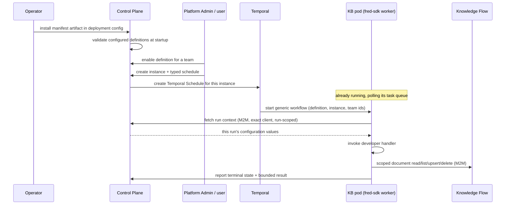

## Context

See proposal.md — Why. Four repository facts shape this design. They were
established by an earlier focused audit and are restated only as constraints:

- The existing agentic pod is a pure HTTP runtime and uses no Temporal. A KB
  pod cannot be modelled on it.
- `fred_core.scheduler.schedules.ensure_schedule` is a generic, idempotent
  create-or-update primitive already accepting a schedule id, workflow arguments
  and a policy. Its only callers today are platform singletons.
- There is no per-team or per-instance schedule lifecycle anywhere.
- The field vocabulary a configuration form needs — `FieldSpec`, `FieldType`
  including `secret`, `UIHints` — exists and is already rendered by the
  frontend.

The product constraint that drives everything else: the KB pod is outbound-only.
Temporal must not call it over HTTP and Kubernetes must not need an inbound
service for it. A Temporal worker polling a task queue satisfies both, because
polling is an outbound connection.

## Configured versus online

This distinction is load-bearing and easy to lose.

A **configured** definition is one an operator installed into the Control Plane
deployment configuration and that passed startup validation. That is a static
fact about this deployment's configuration.

**Online** would be a fact about a running pod — that a worker is polling, that
the source is reachable, that the last run succeeded. Fred establishes none of
these, and this design deliberately gives it no way to. There is no
registration, no discovery, no heartbeat and no liveness registry.

The consequence is accepted openly: a Platform Admin can enable, and a user can
create and schedule, a Knowledge Base whose pod does not exist. The first
scheduled execution then times out according to the configured Temporal
timeouts and is recorded as a failed run. Failure is observable but not
immediate, and the UI must never imply otherwise.

## Goals / Non-Goals

**Goals:**

- An author writes a declaration and one handler, and never encounters Temporal.
- A team configures and schedules its own instances, in plain recurrence terms.
- One vertical slice provable end to end: configured → enabled → instance →
  scheduled → dispatched → handler called → documents written through Knowledge
  Flow → result recorded.

**Non-Goals:**

- Everything the implementation owns: discovery, parsing, change detection,
  reconciliation, and the **durable synchronization ledger** — source document
  identity, source version history, revisions/ETags/hashes, mappings to Fred
  document UIDs, cursors, tombstones and the last successful inventory. No
  generic Fred-side or SDK-side synchronization-state store is designed here,
  and no requirement prescribes how an implementation versions or persists that
  state.
- Liveness, leases, heartbeat registries, deregistration, "online" status.
- Scale-to-zero and schedule-time pod activation.
- An asynchronous result callback protocol.

## Lifecycle

Every arrow leaving the pod is outbound. Fred never dials the pod.

## Decisions

### 1. Control Plane owns the Knowledge Base surface

Configured definitions, Platform Admin visibility, team enablement,
team-scoped instances, instance configuration, typed schedules and their
lifecycle, run records and bounded results, and the authenticated run-context
and result-reporting endpoints all live in control-plane.

*Why:* every one of those is a product/tenancy concern, and control-plane
already owns teams, enablement and instance-shaped objects. Knowledge Flow owns
the document boundary the implementation writes through, and nothing else here.

*Alternative considered:* placing the surface in knowledge-flow because it owns
ingestion and an existing Temporal worker. Rejected — it would put team
enablement and instance lifecycle in the knowledge plane, away from every
existing analogue.

### 2. Definitions are configured, never registered

An operator installs the SDK-produced manifest artifact into the Control Plane
deployment configuration. Control Plane validates configured definitions at
startup and refuses to start on an invalid one, so a deployment never serves a
half-valid catalog.

*Why:* a registration endpoint would mean an inbound trust boundary, an
availability question, and a catalog whose contents depend on which pods
happened to start. Configuration makes the catalog a reviewable, versioned
property of the deployment.

*Consequence accepted:* installing a new definition requires a deployment
configuration change.

### 3. One user-facing configuration level

The definition declares one list of instance configuration fields; each
instance stores its own values. Team enablement is an availability gate storing
no configuration. Pod deployment configuration — endpoints and credentials the
operator fixes for the pod itself — stays in the pod's environment and is never
a Fred instance field.

*Why:* three levels for one set of values is a precedence rule nobody will
remember. One level keeps "where does this value live?" answerable.

### 4. Schedule belongs to the instance, expressed in user terms

A typed recurrence on the instance: daily or weekly, a local time of day, an
IANA time zone, and for weekly a day of the week. Not on the manifest — an
implementation has no business dictating a team's cadence. No raw cron, and no
Temporal vocabulary reaching the user.

Overlap is a platform default, not a user choice: a run due while the previous
one is still active is skipped. The implementation owns change detection, and a
second concurrent pass over the same source is exactly how silent double-writes
happen.

*Why typed rather than cron:* cron carries no time zone, has no honest
representation of "no schedule", and says nothing about overlap.

### 5. Dedicated confidential M2M client, verified exactly

Each KB application has its own confidential M2M client, obtained through
Fred's existing `M2MTokenProvider` client-credentials pattern. The configured
definition binds the expected exact client identity.

Every runtime call from a KB pod is authorized by verifying the
signature-derived `azp` / client id against the definition's configured client.
Membership of a broad service role is not sufficient on its own — `service_agent`
alone does not authorize a KB call. A user JWT is never used and never
propagated: a scheduled run has no user present, and minting one would invent a
session that does not exist.

*Why exact-client binding:* without it, any workload holding a service token
could read any definition's instance configuration, which is where the source
secrets are.

### 6. Run-scoped context

The workflow input carries stable identifiers only — definition, instance and
team. A run identifier is derived internally when the workflow starts rather
than being a static schedule argument, so every occurrence is distinguishable
without rewriting the schedule.

The runtime fetches configuration through an authenticated call scoped to an
active run, its instance and its team. The exact client bound to one definition
cannot retrieve another definition's or another instance's configuration.

*Why:* Temporal persists workflow inputs in history, replicated and retained by
retention policy. Identifiers are safe to keep forever; configuration values
and secrets are not. Fetching per run means secrets cross once, into a live
activity, and are gone when it ends.

The same reasoning bounds what history is *for*. Workflow history is an
execution record, not a synchronization database: it must never be used to
carry per-document state between runs. An implementation needing to know what
it saw last time reads its own ledger, not Temporal. History is retained on a
retention policy nobody sets for correctness, replays under determinism rules
that make it a hostile place to store facts, and grows without bound if used
this way. What crosses between runs through Fred is the materialized document
projection — nothing else.

### 7. Activity result plus bounded Control Plane reporting

The handler returns a bounded result to the activity adapter. The adapter
returns it to the generic workflow and reports the terminal state and bounded
result to Control Plane. Heartbeat, cancellation and retry plumbing live inside
the adapter, never in the handler signature.

A long synchronization stays one heartbeat-enabled activity with an explicit
timeout. No asynchronous callback or job protocol is designed for the MVP.

*Why keep I/O in the activity:* Temporal's determinism constraint is a real
trap. All side effects in the activity means the author cannot break replay,
because the author never writes workflow code.

### 8. Bounded, extensible result

A terminal outcome; a bounded human-readable summary; generic counters for
discovered, created, updated, removed and unchanged; bounded structured
warnings and errors; and an optional JSON-safe map of implementation-defined
metrics. Nothing HTTP- or Markdown-specific. Bounds are contract, not courtesy:
an unbounded summary is how a run result becomes a payload incident.

### 9. Schedule lifecycle follows instance lifecycle

Creating an instance with a recurrence creates its Temporal Schedule. Changing
the recurrence updates it in place. Disabling the instance suspends the
schedule; re-enabling resumes it without the user re-entering the recurrence;
deleting the instance deletes the schedule. No schedule outlives its instance.

*Why suspend rather than delete on disable:* re-enabling should not silently
lose the cadence the user chose.

### 10. Temporal stays internal; fred-sdk may import it

Task queues, schedule specs, overlap policy, retry policies, heartbeats and
workflow/activity definitions are internal. The author-facing surface exposes
the declaration, the handler decorator, the context, the result and the run
entry point.

fred-sdk depends on `temporalio` internally, and that is fine. The guarantee
tested is about the **public surface** — exported names and handler signatures
carry no Temporal type or term. An earlier draft proposed asserting `temporalio`
stays absent from `sys.modules`; that test is withdrawn, because it constrains
packaging rather than the contract.

### 11. Destination boundary

A KB implementation must not receive OpenSearch or S3/SeaweedFS credentials
through the Fred SDK contract. The supported path is:

    KB implementation → authenticated Knowledge Flow document boundary
                      → OpenSearch and S3/SeaweedFS

The minimum invariant this change commits to: the KB runtime uses a Knowledge
Flow boundary capable of scoped document read, list, upsert and delete; every
operation is restricted to the current team and Knowledge Base instance; the
exact KB client identity and the active run binding are validated; and direct
infrastructure access is outside the supported portable contract.

Whether today's Knowledge Flow push APIs already satisfy that invariant is not
asserted here. One focused task determines the smallest extension needed. This
change does not design or implement it.

Source authentication and Fred authentication stay separate: the WebDAV/HTTP
token is instance configuration used only against the external source; the M2M
token is the pod's workload identity used only against Fred APIs.

## Risks / Trade-offs

**A configured definition can have no running pod, and nothing detects it.** →
Accepted and made explicit: the first scheduled run times out and is recorded
as failed. The mitigation is honesty in the UI, not a liveness mechanism.

**Installing a definition requires a deployment configuration change.** →
Accepted. It is the direct cost of refusing a registration endpoint, and it buys
a catalog that is reviewable and versioned with the deployment.

**A first full synchronization may outrun its activity timeout.** → Heartbeating
extends the window and the timeout is explicit, but a very large first sync may
need the implementation to bound its own work per run. No callback protocol is
being designed to paper over this in the MVP.

**Control Plane gains an endpoint returning instance configuration including
secrets.** → The direct consequence of keeping secrets out of workflow history.
Risk is concentrated in one route, so exact-client verification plus run
scoping are contract requirements, not implementation details.

## Open Questions

1. **How is the manifest artifact installed, and what happens to existing
   instances when a definition's version changes its fields?** Inline in the
   deployment configuration or referenced as a file is undecided; so is whether
   a field removed in a new version invalidates instances holding a value for it.
2. **What is the activity timeout ceiling for one synchronization run?** The MVP
   commits to one heartbeat-enabled activity with an explicit timeout, but the
   value bounds what a first full sync can achieve and has not been chosen.
